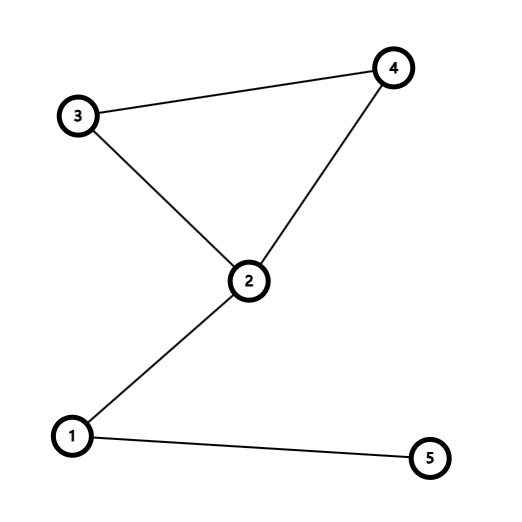
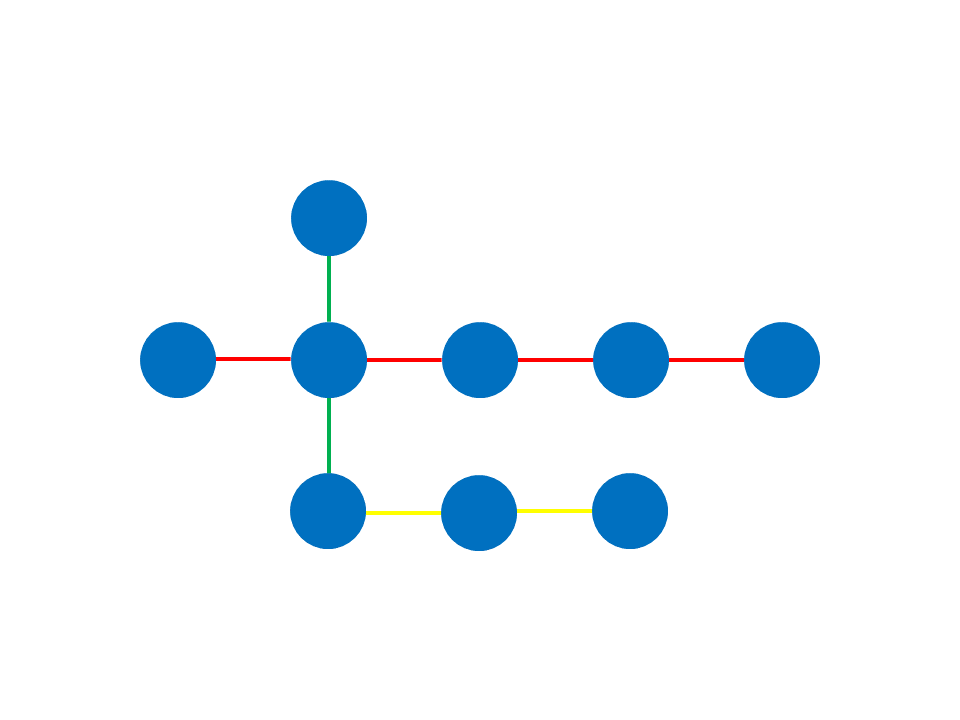
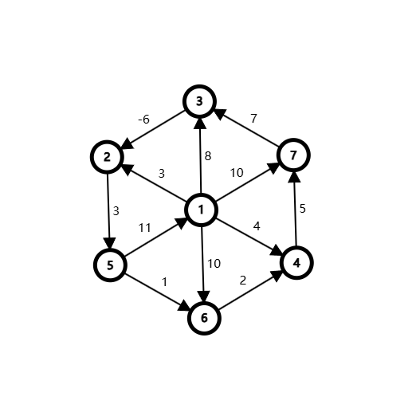
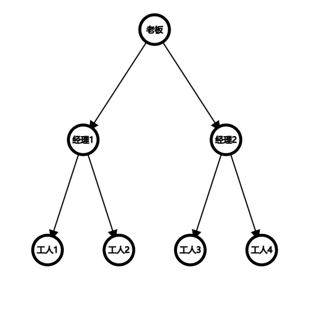
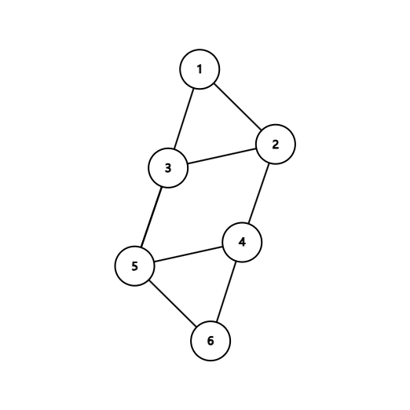
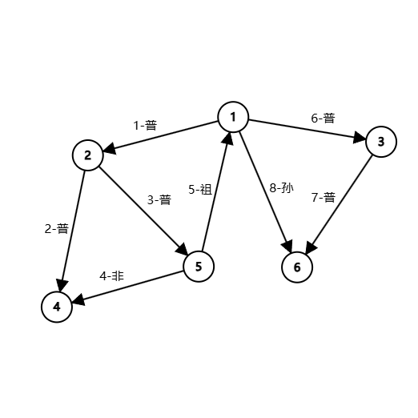
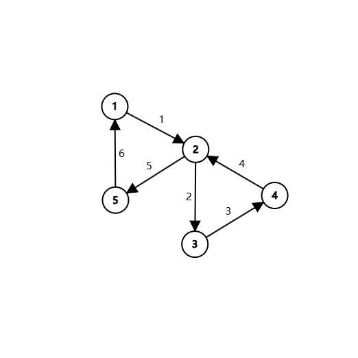

# 长河乱语 五

OTTF 2024 9 21 起写

## 第0章 引子

风刮得树叶嘈杂，何乐乌和道：“真巧，就让我们从树开始。”

## 第1章 图

> 小兔子乖乖，把门儿开开。
>
> ——儿歌《小兔子乖乖》

记得我们的迷宫吗？对，就是这个：



我们把每个岔路口看成了一个“节点”，又把每个笔直的小路看成了一个“线段”，于是就得到了这种图片。说实话，一堆东西连接起来的“节点”可真够常见的，比如说地铁线路简图、电路图、甚至公司的职员图。就放一下地铁线路简图吧：



哦吼，有这么多叫做“图”的实际物体，我们是否可以把它们抽象成一种——嗯——数据结构呢？

想得不错，我们就是要这么做！首先，节点就是节点；其次，“线段”这个名称需要修改一下，我们不妨叫它“边”。这么说来，一个图就是一些点以及把它们连接起来的边的集合。

那么问题来了：如何用伪代码来表示一个图呢？欸！两个点之间要么有直接的边相连，要么没有。所以，我们开一个布尔值的二维数组来表示点直接直接相连的关系就可以了，我们把它称为“邻接矩阵”。比如刚才的迷宫图，有五个节点，我们就`一列元素graph，共有5个元素，每个元素是一列布尔值，共有5个布尔值`。这样一来，我们就应该在二维数组里这样填充：

``` 字符艺术
0 1 0 0 1
1 0 1 1 0
0 1 0 1 0
0 1 1 0 0
1 0 0 0 0
```

我把“是”写成了“1”，把“否”写成了“0”，而第$i$行的第$j$个元素表示节点$i$与节点$j$间有没有直接相连。如果这样存图的话，检查两个节点之间有没有边直接相连的时间复杂度就是$O(1)$的。不过，将节点数设成$n$，我们会发现如果我们需要遍历每一个与某个点直接相连的点，我们需要遍历整整$n$次，因为我们会检查所有的点是否与这个点相连；同时，这个二维数组的空间也是$O(n)$的。

在某些场合下，这种存图方式可能不太优秀。所以，要不……想出另一种存图方式？嗯——还是开一个二维数组，但是每一行里都直接写上与改行直接相连的元素，然后把它叫做“邻接表”怎么样？我的意思是`一列元素graph，共5个元素，每个元素是一列数，开始时长度为0`，然后当我们添加一个边时，如果$u$与$v$是边的两个端点，我们就`graph[u]添加v`——哦，别忘了还要`graph[v]添加u`。所以，我们的二维数组最后会变成这样：

``` 字符艺术
2 5
1 3 4
2 4
2 3
1
```

空间变成了$O(n)$的，而遍历与一个点直接相连的店也方便得多。当然，检查两个点是否直接相连变成了$O(n)$的。

注意到，刚才我们在添加边时需要在`graph`的两个元素添加节点。这是因为我没有给边画上一个方向，表示这条边是“从哪里到哪里”的。换言之，这条边是没有指定方向的、是“无向”的。相应的，如果一条边被指定了方向，那么它就是“有向”的。如果一个图里都是无向边，我们就说这个图是“无向图”。那么“有向图”是什么？全都是有向边的图吗？嗯——其实你可以说只要有一条有向边的图就是有向图，我们把无向图单拎出来是因为无向边会带来一点有意思的性质，比如无向图的邻接矩阵肯定是轴对称图形。

值得一提，有些人喜欢使用被称为“链式前向星”的存图工具，这是一种链表，是邻接表的替代品，是可变长数组还未兴盛时的奇异工具。大部分时候，如果你看到有人在用链式前向星，你可以认为它和邻接表差不多。

## 第2章 单源最短路

> 通过研究高级空间翘曲技术，所有资源都可以瞬间传输，同时也能够解决延迟问题。
>
> ——一款名为《yorg.io》的网页游戏

你有没有想过，我们的图好像只是粗暴地把点连接起来，而真实世界中的图则有更多信息需要维护——比如边的长度？你看，在不同的岔路口之间，街道的长度、通过它所需要的时间、甚至所需要的金钱都会有所不同吧？所以，我们考虑给边添加上一个数字，管它叫做“边权”。比如，我们可以给迷宫里的边添加上边权。


啊哈？为什么节点2和节点3之间的边权是1，节点2和节点4之间的边权是3，而节点2和节点4之间的边权是5啊？它们不是组成了一个三角形吗？好吧……其实我们的边权十分多样，经常会有这种不满足三角形的性质的情况。比如说——有可能边权指的是通过这条路所需要花费的金钱，而节点2与节点4之间的路是用金子做的，十分昂贵；其他路则都是普通道路。

只需要稍稍改进一下邻接表就可以存下这张图。

``` 伪代码
一个边由一个数终点和一个数边权组成
一列元素graph，共5个元素，每个元素是一列边，开始时长度为0
```

就像一个位置由一个数行和一个数列组成一样，为了方便，我们可以定义出“边”这种数据结构。需要注意，我们的边不需要存储起点，因为起点就是graph的第一个维度。

现在，如果我需要你找到从每个节点出发，到达每一个其他节点所需要的最小花费，你能找到答案吗？嗯，好像一眼就能看出来，对吧？

来点儿刺激的，如果我画一个更复杂的图，比如一个有向图，然后再多加一些点和边呢？



这个图中的边比较多，我们需要一个算法来帮我们计算一些点之间各边边权之和最小的路径，也就是“最短路”。为了方便，我们先来考虑从某个节点开始，到所有其他节点各自的最短路。这个问题被称作“单源最短路”。

想一想，最短路计算的难点在哪里呢？哦，就是有一些道路不符合三角形的性质，或者说是“三角形不等式”。比如从节点1到节点2的边的边权——我们不妨用$w(1,2)$标记——为$3$，而$w(1,3)+w(3,2)$的值则是$2$。这样，其实从节点1到节点2的边可以用边权和更小的另外两条边替代，我们在计算中可以用$w(1,3)+w(3,2)$覆盖掉原先$w(1,2)$的值，这可以被称作“松弛”——好主意，具体来说呢？

考虑到我们是计算到其他节点各自的最短路，我们就可以用一个数组来存放到达每个节点的最短路的长度。一开始，因为我们没有进行计算，我们姑且把数组中的每一项都设为无穷大。而在计算过程中，我们不断更新答案——不断松弛。最终，我们就能得到最短路。当然，需要注意，数组中对应起点的那一项一定是0。

嘶……我们可以怎样进行松弛呢？要不……每一次都遍历所有边并尝试进行松弛，直到松无可松？好主意，就让我们以节点1为起点，写一个伪代码。

``` 伪代码
一个边由一个数终点和一个数边权组成
一列元素graph，共n个元素，每个元素是一列边，开始时长度为0

一列数dis，长度为n，一开始第1项为0，其他项都为INF

Bellman–Ford最短路（）：
    重复执行：
        一个布尔值flag为真
            u从1到n循环：
                对于graph[u]中的每一个边，其终点v与边权w：
                    如果 dis[v] 大于 dis[u]+w
                    dis[v] 为 dis[u]+w
                    flag 为 假
        如果 flag：
            退出循环
```

这个算法叫做Bellman–Ford算法，既贝尔曼-福特算法，因为它是被理查德·贝尔曼和莱斯特·福特创立的。在未来的学习中，我们会见到很多用其创造者命名的算法。顺便，你可能注意到了：在图论中，我们习惯用$u,v,w$这三个字母来表示边的两端及边权。

节点数已经是$n$了，我们再把边数设成$m$，这个算法的时间复杂度就是$O(nm)$。这是因为从起点到终点的一个最短路最多包含$n-1$条边，不然就是在绕路；而每一次尝试松弛所有边都肯定会松弛至少一条边，不然就会结束算法。

不对诶！看看我们的图，显然其中有一个边的边权是负数。在这里，这不算什么。但是如果有几条边权为负数的边首尾相连，组成一个环，而且起点还能到达这个环，那么对于某些节点不就不存在最短路了吗？这种环被称为负环。可以发现，如果我们重复执行到了第$n+1$次，我们就可以认为从起点可以到达一个负环。

可以改进这个算法吗？仔细想想，只有被松驰过的边的节点伸出来的边才有可能被松弛，所以我们可以改进这个算法：我们使用一个队列和一个布尔值数组，维护一个伸出来的边可能引起松弛操作的点的集合，一直松弛下去直到集合为空。当然，`graph`和`dis`的定义还是相同的，只是我不想写出来。

``` 伪代码
一个队列point，一开始有一个数1
一列布尔值judge，长度为n，一开始第1项为真，其他项都为假

Bellman–Ford最短路（）：
    重复执行，如果point不为空：
        一个数u，为point的队首
        point删除队首
        judge[u] 为 假
        对于graph[u]中的每一个边，其终点v与边权w：
            如果 dis[v] 大于 dis[u]+w：
                dis[v] 为 dis[u]+w
                如果 judge[v] 为 假：
                    judge[v] 为 真
                    point添加v
```

这种算法可以被称作Bellman–Ford算法的队列优化，不过也有些人称之为“Shortest Path Faster Algorithm”，并缩写为SPFA。

这个算法的时间复杂度是——好吧，最坏还是$O(nm)$，有一些极端的图能让它运行得很慢。不过它在普通情况下已经表现得不错了。顺带一提，如果你想判断从起点能否遇到一个负环，你可以建立一个`count`数组，让它记录到达每个点的最短路经过了几条边。如果`count`的某一项大于等于`n`，你就可以认为从起点能碰到负环。还有，从起点不能遇到负环并不意味着图里没有负环。如果你想判断图里有没有负环，你可以建立一个超级大点，让它朝其他所有点连边权为0的边，然后使用刚才判断能不能遇到负环的方法。

有另一位计算机科学家，叫做Dijkstra，既迪科斯彻，他也发明了求最短路的算法。现在，让我们来看看Dijkstra算法。

我们设立两个点集：一个是已经确定了到其最短路的点的集合，我们叫它$S$；另一个则是没有确定到其最短路的点的集合，我们叫它$T$。一开始，所有点都属于集合$T$，但是当然，起点的最短路会被我们设成$0$。

然后，我们只需要重复执行两个步骤：1.从集合$T$中拿出一个最短路最短的点$u$并把它放到集合$S$中；2.用从$u$伸出的边来松弛这些边的另一端。这样重复下去，等到集合$T$为空，我们就求出从起点开始的所有最短路了。

这个算法为什么是正确的呢？首先，我们要知道：步骤1中处理的点$u$的最短路肯定已经确定了。为什么呢？让我们来用一种递推的方法解决。首先，一开始时我们会拿出起点，它的最短路是$0$，这是肯定的。然后，当我们拿出最短路被确定的前$i$个点后，我们可以证明拿出下一个点$u_{i+1}$时其最短路也是被确定的。如果我们将一个点$u$实际的最短路称为$D(u)$，那么我们就是要证明在取出$u_{i+1}$时，其对应的`dist`数组值$dist(u_{i+1})=D(u_{i+1})$。

如若不然，既我们假设$D(u_{i+1}) < dist(u_{i+1})$，也就是有另一条从起点到$u_{i+1}$的最短路径，我们称之为路径$R$。路径$R$中肯定有一些点在集合$T$中，我们选取这里面的第一个点，称为$u_y$。我们再将$u_y$在路径中的前面那个点称为$u_x$，显然$u_x$在集合$S$中，也就是说$dist(u_x)=D(u_x)$。而我们肯定会用这个点来松弛一下$u_y$，又因为这两个点都在一个最短路$R$上，我们可以想到这时$u_y$的最短路已经被计算出来，$dist(u_y)=D(u_y)$。

再带上$dist(u_{i+1})$，我们可以认为$dist(u_y)=D(u_y) \leq D(u_{i+1}) < dist(u_{i+1})$——发现了一点端倪？别急，让我把这段说完——所以$dist(u_{i+1}) > dist(u_y)$。而又因为$u_{i+1}$是作为`dist`数组值最小的点被选出来的，我们知道$dist(u_{i+1}) \leq dist(u_y)$。这样一来，我们就得到了……一个矛盾，所以最初的假设肯定不成立。

很好，步骤1中处理的点$u$的最短路肯定已经确定了，然后呢？哼哼，这个条件等同于算法成立啊，因为我们自然是拿$dist$数组作为答案。但是还记得吗，我在刚才的证明中断言了$D(u_y) \leq D(u_{i+1})$，这就需要这两个点之间的边权之和不是负数。换言之，刚才的证明依赖着图中没有负权边！所以这个算法只能在边权不为负数的途中运行。

怎样实现这个算法呢？它最外层的循环肯定需要$n$次，而里面还有一个寻找最小数的操作，我们当然可以进行暴力，得到$O(n^2)$算法，但我们也可以使用二叉堆——或者说优先队列，二叉堆的一种包装，每次能让人获得最大或最小的元素。

``` 伪代码
一个大点由一个数距离与一个数点编号组成，且比较大小时依照距离
一个小的数在前的优先队列point，一开始有一个大点，距离为0，点编号为1
一列布尔值judge，长度为n，一开始第1项为真，其他项都为假

Dijkstra最短路（）：
    重复执行，如果point不为空：
        一个数u，为point的队首的点编号
        point删除队首
        如果judge[u]为假：
            对于graph[u]中的每一个边，其终点v与边权w：
                如果 dis[v] 大于 dis[u]+w：
                    dis[v] 为 dis[u]+w
                    如果 judge[v] 为 假：
                        judge[v] 为 真
                        一个大点newPoint，距离为judge[v]，点编号为v
                        point添加newPoint
```

这样，使用优先队列，我们会进行$n$次优先队列取队首，还可能会进行$m$次优先队列添加元素，而优先队列里最多有每条边对应的一个元素，算法的复杂度就是$O((n+m) \log m)$。如果$n$与$m$大约相等，我们称之为稀疏图，那么复杂度可以被看作$O(n \log m)$，比较优秀。当然，如果$n^2$与$m$大约相等，我们称之为稠密图，那么复杂度可以被看成$n^2 \log m$，倒是不如较为暴力的算法。当然，总体而言，我们把这个用优先队列实现的算法的复杂度视为$O(m \log m)$。

## 第3章 多源最短路

> 约翰孙其实是约翰子。
>
> ——由“Johnson”的翻译生发出的感想

单源最短路问题已经被我们解决了，现在，让我们来想想，对于一个带边权的有向图，如何得出每两个点之间的最短路呢？

来重新思考一下最短路的形成：有一个起点$u$，一个起点$v$，然后从起点开始经过某些点从而到达终点。诶！我们可以在这个“某些点”上做做文章。

怎么做文章呢？一位名叫Floyd，既弗洛伊德的科学家想出了办法。我们先来设立一个名为`dis`的三维数组，令`dis[k][u][v]`表示从节点$u$到节点$v$且中途只通过编号小于等于$k$的节点的最短路径值——为什么是“只通过编号小于等于$k$的节点”呢？因为我们要慢慢扩大问题范围啊。

一开始，我们给所有形如`dis[0][u][v]`的项赋值。显然，如果`u=v`，这一项就是0；除此之外，如果这两个节点之间有边直接相连，那我们就让这一项等于这个边权；除此之外，也就是这两个节点之间没有边直接相连，我们就让这一项为无穷大。

那么，在扩大问题的时候，该如何做呢？对于一个`dis[k][u][v]`，它和`dis[k-1][u][v]`有什么差距呢？哦，前者的路径可以在中途通过节点$k$，而后者不能——差距就在这里，答案也在这里。我们让`dis[k][u][v] 为 最大（dis[k-1][u][v]，dis[k-1][u][k]+dis[k-1][k][v]）`，因为`dis[k-1][u][k]+dis[k-1][k][v]`就是在中途通过一下节点$k$能得到的答案啊。

这显然是动态规划的思想！还有一件事，显然这个数组的第一维在运算途中其实无关紧要，我们可以直接舍去。这样，我们能写出这样的伪代码：

``` 伪代码
一个边由一个数终点和一个数边权组成
一列元素graph，共n个元素，每个元素是一列边，开始时长度为0

一列元素dis，共n个元素，每个元素是一列数，共n个数，一开始都为INF

Floyd最短路（）：
    u从1到n循环：
        对于graph[u]中的每一个边，其终点v与边权w：
            dis[u][v] 为 w
        dis[u][u] 为 0
    
    k从1到n循环：
        u从1到n循环：
            v从1到n循环：
                dis[u][v] 为 最大（dis[u][v]，dis[u][k] + dis[k][v]）
```

不错的算法！$O(n^3)$的时间复杂度对多源最短路已经很好了。但是我有一个想法：既然Dijkstra算法的时间复杂度是$O(m \log m)$，那么进行$n$此这个算法的复杂度不就是$O(n m \log m)$吗？在稀疏图中，这比$Floyd$算法还要好，为什么不这么做呢？哈哈，想必你注意到了——Dijkstra算法要求我们的图中没有负边权，而我们可没有说多源最短路的图中没有负权啊。

诶！还有一个想法！既然我们要让图中没有负边权，可不可以把所有边都加上一个正数，使得所有边权都不是负数，然后在计算出结果后再进行处理呢？其实这不可行。比如说，如果从一个节点$u$到另一个节点$v$有两条路：第一条路中有两条边，它们的边权都是$-2$，总和就是$-4$；而另一条路只有一条边，其边权是$-3$。显然，第一条路是最短路。然而，如果我们把边权都加上3，第一条路的边权就变成了$2$，第二条路的边权就变成了$0$，最短路就变成第二条路了！

然而，这给了我们启示——能不能对于每一条边，都用一种独特的方法处理一下它的边权，使得这些边权都不为负数，且这之后的最短路仍然是之前的最短路呢？集中精力面对后面的要求：在处理边权后，最短路依然是之前的最短路。如果将两节点间的一条边记作$w$，之前的最短路$D(u,v)$就是$w(u,p_1)+w(p_1,p_2)+\dots+w(p_{l-2},v)$，其中$l$是这条路上节点的个数。而如果我们把每个$w$值都增加了一个对应的$num$值，那么新的最短路$D'(u,v)$就是$w(u,p_1)+num(u,p_1)+w(p_1,p_2)+num(p_1,p_2)+\dots+w(p_{l-2},v)+num(p_{l-2},v)$。我们想要的，就是在每组$D'$的决定过程中，发挥作用的只有$w$的值，而不是$num$的值。换言之，如果$u$和$v$是确定的，那么$num(u,p_1)+num(p_1,p_2)+\dots+num(p_{l-2},v)$是一个定值，不管它中间经过了哪些节点。

有没有什么想法？哦，这是加法，但我们需要一个只与开头和结尾的两个数相关的定值，要不要用减法解决？比如说，对于一个$num(p_i,p_{i+1})$，我们找到节点$i$和$i+1$所拥有的值$val$，让这个$num$等于$val(p_i)-val(p_{i+1})$。这样下来，整个$num(u,p_1)+num(p_1,p_2)+\dots+num(p_{l-2},v)$，就会等于$val(u)-val(p_1)+val(p_1)-val(p_2)+\dots+val(p_{l-2})-val(v)$，也就是$val(u)-val(v)$！

是的，我们只要为每一个节点找到一个值，用边的终点和起点的这个值的差来更新边权就可以了！那么该找哪个值，才能满足前面的要求——让边权不为负数呢？随便胡搞一下，如果边权是负数，那么只要把边权的相反数加回来，边权就不是负数了。怎样把边权的相反数加回来呢？对于一个节点$v$，如果它是边权和为负数的路径的终点，那么我们肯定可以找到一个节点$u$，使得$D(u,v)$比任何其他节点$p$所对应的$D(p,v)$都要小——甚至包括$D(v,v)$，因为我们一定找得到小于零的$D(u,v)$。那么，我们让$val(v)=-D(u,v)$，就一定能把所有以$v$为终点的边转化为非负值。

该怎么得到这种$D(u,v)$呢？啊哈！我们创造出一个新节点，把它编号为$0$。让这个$0$号节点连向每一个其他节点，并且边权都为$0$。然后，用Bellman–Ford算法求出从$0$号节点到其他节点的最短路$D(0,v)$——这个值就等于节点$v$与它对应的节点$u$之间的$D(u,v)$！因为如果节点$v$并不作为任何边权和为负数的路径的终点，$D(0,v)$所对应的路径就是从节点$0$直接到节点$v$，值为$0$；否则，$D(0,v)$所对应的路径就肯定是从节点$0$到达节点$u$，然后一步步走到节点$v$的路径，因为它才是最短的！

总结一下这个算法的步骤：首先，我们建立$0$号节点，对$n$个其他节点都练一条边权为$0$的边；其次，我们以$0$号节点为起点，用Bellman-Ford算法计算它到每个其他节点$v$的最短路$D(0,v)$；然后，我们将每个原图中的边的边权$w(u,v)$改为$w(u,v)+D(0,u)-D(0,v)$；最后，我们进行$n$次Dijkstra算法，求出多源最短路。这个算法的时间复杂度——自然是$O(n m \log m)$。

真是个集大成的最短路算法！我们太强啦！好吧——它由科学家Johnson发明，这就是Johnson最短路算法。

## 第4章 最小生成树

> 我们还会研究树，当然包括叶子和根。
>
> ——还是那个学长

还记得图的定义吗？图是由节点和边组成的，没错吧？你说，如果给图加一点限制，能不能创造出更特殊的数据结构呢？换句话说，有什么现实中的东西既满足图的定义，又更特殊一点，从而使我们能把它们抽象成图的子集呢？

来看几个例子：一个公司中，一个人可能有很多直接下属，但这个人只能有一个直接上司，而公司最大的上司也只有一个；一个政区划分体系中，一个政区可能会被划分成很多小一点的政区，但直接管辖它的政区只有一个，而最大的总政区也只有一个；一棵树中，每根枝条可能会分出几根枝条，但它肯定是从一根枝条上长出来的，同时树的主干也只有一个。

发现了吗？盯住公司的例子，如果我们把公司中的每个人都视为一个节点，并把直接上下级之间的关系视为一条从上级连向下级的边，那么我们或许能得到这样的图：



发现了吗？在这个图中，对于一个节点，以它为起点的边可能有很多，但以它为终点的边最多只有一个，而不作为任何边的终点的节点也只有一个。如果我们把政区或者树枝的关系抽象成图的话，肯定也会得到这种特例。因此，我们定义出一种特殊的图，名为“树”，因为它十分像一颗倒着的树。

由于是特殊的图，我们也有一些特殊的名词。在一棵树中，对于一个节点，从它伸出来的边指向的节点被称为它的“子节点”，而指向它的边的起点被称为“父节点”。比如说“经理1”节点的父节点是“老板”节点，而“工人1”和“工人2”都是“经理1”节点的子节点。如果一个节点没有父节点，又或者说它是树的“树根”，我们就把它叫做“根节点”。相应的，没有子节点的节点被称为“叶子节点”。

如果我们忽略边的方向，或者说把一棵是有向图的树看成是无向图的树，首先，我们会发现我们好像可以把任意一个点作为树根，然后通过确定边的方向来得到一颗有向树，所以这棵树没有一个确切的根节点，它是一棵“无根树”。其次，我们还能发现这棵树是联通的，从任意一个节点出发总有到达另一个节点的路径。

哦！树还有联通的性质。我们还能发现什么呢？啊，如果把节点和指向它的边对应起来的话，除了根节点的每个节点都能找到对应它的边。换言之，如果节点数为$n$，那边数就是$n-1$。

那么，问题就来了。还记得地图那样的图吗？每个节点代表一个地方，两个地方之间可能会有路直接相同，并且路还会带有权值，不过我们认为路都是双向的，并且整个图是联通的。现在，设一共有$n$个节点，我们需要找到$n-1$条边，使得这些边联通了所有点，并求出如此能找出的最小边权之和。

你会发现，这其实就是从一个无向联通图中选出一些边，与所有节点来得到一棵树，并且使得这棵树的权值总和是最小的。我们将这棵树称为这个图的“最小生成树”。

为了求出一个图的最小生成树，我们肯定要在图中从零开始构造一棵树。边是树的重要组成部分，并且决定一棵树是不是最小生成树。既然这样，我们可以尝试找到一种从零开始的加边方式，使得重复$n-1$次后，得到一棵最小生成树。当然，需要注意的是，在算法的运行过程中，我们可能会暂时得到一个不相通的子图。

科学家Kruskal提出了这样一个算法：先设立一个为空的子图，然后把边按照边权排序并从小到大遍历：对于每条边，如果这条边的两个端点没有在我们的子图中相通，那就把它们相连，或者说把这条边加入子图中。加入$n-1$条边后，我们的子图就是最小生成树了。

这个算法看起来很有道理，但它究竟为什么是对的呢？为了证明它，我们先明确一点：一个图中可能有很多棵最小生成树，但如果每次添加新边后，当前的我们的子图都被一棵最小生成树包含，那么到最后我们一定能得到一棵最小生成树。那就让我们一步步尝试证明它。

我们随便找一棵最小生成树，把它命名为$T$。接着，将我们的当前拼凑出的图命名为$t$。一开始没有边的时候，$t$肯定被$T$包含。然后，既然老的$t$在$T$中，当添加一条边$e$时，如果$e$在$T$中，新的$t$也就在$T$中。而如果$e$不在$T$中，那么有意思的就来了。



比如在这个图中，如果我们已经选择了$w(1,2),w(1,3),w(4,6),w(5,6)$这四条边，我们就能将$1,2,3$看作一个内部联通的小树兼点集$S$，而将$4,5,6$看作另一个内部联通的小树兼点集$T$，并知道这两个点集间互相没有边在树中相连。这时，如果我们选择了两端为$3$和$5$的一条边$e$，而$T$中却不包含这条边。那么，$T$必定包含另一条类似的、建立起两个点集之间联系的边——不然$T$就不是一个联通的图，更不用说树；并且，这种边在$T$里还是唯一的——不然$T$里就会形成一个环。比如这里，$T$就一定包含$e$对面的两端为$2$与$4$的这条边，我们称它为$E$。

$E$有什么性质呢？值得发现，它是目前唯一的在$T$中而不在$t$中的边。这个时候，显然$E$的权值不小于$e$，不然，根据我们的选边法则，我们就会先考虑$E$；并且，显然$E$的权值不大于$e$，不然，$T$就不是最小生成树，$T-E+e$——把$E$排除而把$e$添加进来之后的新$T$——才是。所以，$e$与$E$的权值相等。

换句话说，对于按这种方法添加的每条边，我们都认为它在局部内完成了一次两个点集间的互通，并且这次互通的代价肯定是最小的。这就使得每次添加边后，所得到的子图都是某个最小生成树的一部分。

你肯定已经想到了，为了实现这个算法，我们既需要进行排序，又需要使用并查集来判断两个点是否已经相连。我就很喜欢把$Kruskal$算法当作并查集的小练习。顺带一提，如果把边的数量设为$m$，那么这个算法的时间复杂度其实就是排序的$O(m \log m)$复杂度，而不怎么被后面那至多$m$次使用并查集的对边的处理所影响——毕竟并查集十分快。

还有另一个最小生成树算法，叫做$Prim$算法，它与$Dijkstra$比较相像。具体来说，它会维护一个点集$S$，代表已经被放到子图里的节点；而另一个点集$T$则代表还没有被放到树里的节点，这个点集中的每个节点都会有一个$dis$值，代表从$S$中的任意一个点走一条边到这个点——如果有这个可能——所需的最小花费。初始时，所有点都在$T$中，且$dis$都是正无穷。

然后，我们每次选择一个$dis$最小的$T$中的点，把它加入$S$，并将它的$dis$所对应的那条边加到当前选择的子图中，接着再用这个点去尝试更新$T$中其它点的$dis$，这样重复进行，直到$T$为空。

这个算法的本质也是寻找联通两个点集间的边，所以自然也可以用类似刚才的方法证明，这里不再赘述。而当然了，这个算法的时间复杂度与Dijkstra类似，是$O((n + m) \log m)$，比Kruskal慢一点。

## 第5章 最近公共祖先

> 春来遍是桃花水，不辨仙源何处寻。
>
> ——王维《桃源行》

树是个很有趣的数据结构，并且其实早就被我们使用了。还记得树状数组和线段树吗？它们的这种层级结构也可以被看作是树。对于这种有趣的数据结构，我们总能找到很多有趣的问题。比如说：找到两个节点的“最近公共祖先”。

什么是“祖先”呢？对于一个节点，它的父节点和它的父节点的祖先统称为它的祖先——哦吼，看，我使用了递归。用人话来说，一个节点的祖先就是从一个节点往上走到根节点途中经过的点，不包括这个节点本身。而对于两个节点$u$与$v$来说，肯定可以找到一些点，使得这些点是这$u$的祖先，又是$v$的祖先。

不过呢，你肯定意识到了，只有在一棵有根树中，一个节点的祖先才是确定的。既然这样，我们现在考虑的应该是一颗有根树，而不像最小生成树算法那样，压根不管树的祖先是谁。诶？既然能对于一个点找到它的所有祖先，那么对于两个点，只要找出它们各自所有的祖先，不就能得到它们所有的公共祖先吗？而这些公共祖先都是节点，我们就可以在一开始就从树根开始，递归处理出每个节点的“深度”`dep`，它在数值上等于某节点与树根的距离加一。这样下来，`dep`最大的公共祖先不就是最近公共祖先吗？

正确的算法！不过显然，这个算法可能会遍历很多点，甚至树中的所有点。为了进行改进，我们将目光聚焦到“寻找祖先”这个操作上。我们可以怎样寻找一个节点的所有祖先呢？呃，要不先来思考一下图的存储方式吧。所有树都是图，所以我们可以使用类似图的方式——对于一个节点，存图时我们存储了所有从它出来的边的另一个端点，那么存树时我们也可以存储树的所有子节点。好像不错，但这无法直接满足我们寻找祖先的要求啊。该怎么办呢？哦，再建立一个数组`dad`，对于每个节点，它的`dad`就存储它的父节点；根节点除外，忘了方便，它的`dad`被认为是它自己。这样，我们就可以从任意一个节点开始，用一个节点一个节点向上的方法找到它的所有祖先。

聪明的你或许有一个想法——分两次从两个节点开始寻找祖先也太不划算了，为什么不同时从两个节点开始往上走，直到交汇到一起呢？这个想法可以被表现为：

``` 伪代码
最近公共祖先（一个数u，一个数v）：
    重复执行，如果u不等于v：
        u 为 dad[u]
        v 为 dad[v]
    返回 u
```

不错嘛，只是有一个问题：如果这两个节点的深度不同，显然它们只能在根节点交汇了，这不对。嗯，先来假设`dep[u] 大于 dep[v]`吧，在这种情况下，我们可以：

``` 伪代码
重复执行，如果dep[u] 大于 dep[v]：
    u 为 dad[u]
```

啊，只让一个节点往上去，直到它们的深度相同，真有我们的。但如果`dep[u] 小于 dep[v]`呢？我们当然可以把上面的伪代码复制一下再修改一下，但其实，我们也可以`交换（u，v）`。这样下来，我们现在的算法就是：

``` 伪代码
最近公共祖先（一个数u，一个数v）：
    如果dep[u] 小于 dep[v]：
        交换（u，v）
    重复执行，如果dep[u] 大于 dep[v]：
        u 为 dad[u]
    重复执行，如果u不等于v：
        u 为 dad[u]
        v 为 dad[v]
    返回 u
```

挺不错的算法。但现在，我要做一件有点疯狂的事——扩展`dad`为二维数组！具体来说，现在`dad`是`一列元素dad，共n个元素，每个元素是一列数，共len个数`，而对于任意节点`u`，`dad[u][0]`——我在此处暂且引入0作为下标——就是原来的`dad[u]`，而其它的`dad[u][i]`则要等于`dad[dad[u][i-1]][i-1]`。比如`dad[u][1]`就等于`dad[dad[u][0]][0]`，即`u`的父节点的父节点，或者说……爷节点；而`dad[u][2]`就是`u`的爷节点的爷节点。最后来处理一下`len`这个凭空出现的“魔数”，我对它的要求是对于任意节点`u`，`dad[u][len-1]`——即数组的第二个下标取到最大值时，毕竟我把0也拿来当下标了——必须是根节点。比如如果这棵树中节点的`dep`最大是8，那`len-1`至少也得是3，也就是说`len`不能小于4。

发现了吗？我让`dad`储存了每个节点的某些祖先，且对于这些祖先，要么他与此节点的深度差是2的非负整数次幂，要么它是根节点。这有什么用呢？我们来在这种条件下改写一下算法中$u$单独往上爬的部分：

``` 伪代码
i从len-1到0循环：
    如果dep[dad[u][i]] 大于等于 dep[v]：
        u 为 dad[u][i]
```

看看我们发现了什么？哦，太天才了！这么说吧，从节点开始往上爬的过程，其实就是消除深度差$dep[u]-dep[v]$的过程。而我们每次都让$u$按照$dad$给出的祖先去往上爬，也就是让深度差减去一个2的非负整数次幂。这样下去深度差一定能被减完，因为——任意一个非负整数都可以被表示成几个互不相同的2的非负整数次幂之和，只要我们从大到小用这些幂试验——这一小句结论跟二进制有关，如果你没搞懂，先略过。而显然$len$至多是$\log n+1$，所以这段代码就是$O(\log n)$的。

基于这种天才的想法，我们来重写一下两个节点一起往上爬那段：

``` 伪代码
i从len-1到0循环：
    如果dad[u][i] 不等于 dad[v][i]：
        u 为 dad[u][i]
        v 为 dad[v][i]
```

需要注意，这一番操作后`u`和`v`都不是我们需要的答案，`dad[u][0]`或者`dad[v][0]`才是。这是因为如果我们想让它们最终爬到最近公共祖先那里的话，控制它们不越过去就有点不可能；而如果我们降低要求——真的降低——让它们最终爬到公共祖先的子节点，那么判断双方爬上去后是否交汇就可以保证它们不越过终点。当然了，由于我们最终会返回`dad[u][0]`，如果你在让这两个节点开始一起往上之前就发现它们碰到了一起，那么显然它们已经处在最近公共祖先那里了，不要进行后面的操作，要提前返回$u$。

总的来说，我们的算法就是：

``` 伪代码
最近公共祖先（一个数u，一个数v）：
    如果dep[u] 小于 dep[v]：
        交换（u，v）
    i从len-1到0循环：
        如果dep[dad[u][i]] 大于等于 dep[v]：
            u 为 dad[u][i]
    如果u等于v：
        返回 u

    i从len-1到0循环：
        如果dad[u][i] 不等于 dad[v][i]：
            u 为 dad[u][i]
            v 为 dad[v][i]
    返回 dad[u][0]
```

这是一个绝妙的$O(\log n)$算法，原因不再赘述。我要问的是：你是否想起来“稀疏表”呢？它也使用了一个范围成倍扩张的疯狂数组，这种思想被我们称为“倍增”。

## 第6章 拓扑排序

> 瞻前而顾后兮，相观民之计极。
>
> ——屈原《离骚》

世上的很多事情都是有依赖的，小学数学中的时间安排问题就有这样的例子：你想要泡茶，茶杯已经摆在桌子上了，需要完成三个任务——把茶叶放到茶杯里，烧开水，把开水倒到茶杯里。如果你想要完成“把开水倒到茶杯里”这个任务，就需要先完成“烧开水”这个任务，这是一种依赖。相对应的，“把茶叶放到茶杯里”就没有什么依赖的任务。如果我们把任务抽象成节点，把依赖关系抽象成从被依赖的任务指向依赖其他任务的任务的边，就可以抽象出一个依赖图。其中，“烧开水”指向“倒开水”，而“放茶叶”则是一个孤立的节点。

我们能在生活中找到更多有依赖的例子，比如大学中各门课程学习的先后顺序，某种手工产品的制作工艺之类的。直觉告诉我们，我们能为各种依赖关系制作出依赖图；直觉又告诉我们，复杂的依赖图可能会让我们眼花缭乱。这时，如果能找到一个任务的顺序，使得我们可以按照这个顺序完成任务而不违反任务的依赖性，那将会是极好的。

继续用图的思维来给这个问题做抽象：我们需要根据一个有向图找到一个由图中所有节点组成的序列$u$，使得序列中每两个节点$u_i$和$u_j$，如果$u_i$在$u_j$前面，或者说$i>j$，那么，在图中肯定不会有一条从$u_j$到$u_i$的路径——即$u_i$不依赖$u_j$。显然，既然一条边表示一层依赖关系，那么一条路径肯定也会表示依赖关系，只是可能长了一点。我们将这种对图的操作称为“拓扑排序”，这是个奇怪的名字，但接受它吧。

哦吼，把问题用拗口的语言表示出来了，但是你有解决问题的头绪吗？哦，再来看看实际问题中的情况。在想要泡茶时，一开始你就能选择“放茶叶”或“烧开水”的任务，因为它们并不依赖别的任务，而“倒开水”就不能再一开始就选择。这启示我们，在拓扑排序时，只要有不被任何边指向的节点，我们就能把它放入序列的末尾，毕竟我们知道我们可以“完成这个任务”。

那么，该怎么判断一个节点不被任何边指向呢？其实，有一个名词代表的就是指向一个节点的边的数量，即“入度”。比如“放茶叶”“烧开水”的入度都是0，而“倒开水”的就是1。相对应的，“出度”代表的则是从一个节点出发的边的数量，但这对我们要解决的问题无用，暂且不表。显然的，如果一个点的入度是0，那么它就不被任何边指向。想要计算入度也很简单，只需要遍历每个边，并把边指向的点的入度加一就好了。

在把所有入度为0的点放入序列后，我们又应该做什么呢？或许你会尝试把所有入度为1的点放入序列，但这其实并不对。想一想，如果节点$u_i$指向节点$u_j$，而后者又指向$u_k$，那么$u_j$和$u_k$的入度就都是1，刚才提到的做法就有可能让$u_k$在序列中位于$u_j$前面。事实上，我们应该一直把入度为0的点放入序列，直到再也没有这样的点，只是需要做一个小补丁：在把一个点放入序列时，把它所指向的所有点的入度减一，就像这个点从图中被删除了一样。

绝妙的想法！用完成任务的眼光来看，如果一个任务完成了，那么依赖于它的任务就少了一项依赖，并没准儿能被完成了。现在我们的拓扑排序算法已经成熟了，可以写出伪代码：

``` 伪代码
一列元素graph，共n个元素，每个元素是一列数，开始时长度为0
一列数nums，共n个元素
一列数list，开始时长度为0

计算入度（）：
    i从1到n循环：
        对于graph[i]中的每个v：
            nums[v] 为 nums[v]+1

拓扑排序（）：
    重复执行：
        一个布尔值flag为真
        i从1到n循环：
            如果nums[i]为0：
                flag为假
                list末尾添加i
                对于graph[i]中的每个v：
                    nums[v] 为 nums[v]-1
        如果flag为真：
            返回
```

值得注意，为了保证算法有一个退出条件，我们让flag表示“是不是没有入度为0的点了”，如果确实是，那就直接退出。你肯定想到了，如果我们的有向图中有一个首尾相接的环，那么算法肯定会在序列长度到达`n`之前就退出——因为环里的节点无法安排顺序！

## 第7章 连通性

> 荆州北据汉沔，利尽南海，东连吴会，西通巴蜀。
>
> ——《三国志·蜀志·诸葛亮传》中“隆中对”一段

图论的时间快不多喽——让我们来研究一系列重要的问题——连通性问题。

我之前就在讨论最小生成树的时候偷偷阐明过“联通”的概念，但这当然只是一部分。现在，我认真地说明一下：在无向图中，我们有“联通”的概念，节点$u$与节点$v$“联通”指的是从$u$出发可以到达$v$；在有向图中，事情有一点点不一样，从$u$出发可以到达$v$被称为节点$u$“可达”$v$；显然“联通”可以被视为双向的“可达”。从这两个基本的概念，我们可以接着延伸：如果一个无向图中的每两个节点都联通，那么这个图就是“连通图”；如果一个有向图中每两个节点互相可达，那么这个图就是“强连通图”。再疯狂一点！我们先引入“子图”的概念——子图就是从一个图中选取任意边和它们所连的节点而能构成的新图。在一个无向图中，我们把其中是连通图的子图称为“连通分量”；而在有向图中是强连通图的子图则被称为“强连通分量”。一个连通分量或者强连通分量或许能被拆分出几个分量，但是在实际生活中，我们一般考虑分量总数最少，或者说每个分量尽可能大的情况。

一眼看出，我们在讨论无向图时关心单纯的“联通”，而在讨论有向图时关心“强连通”，并且我们似乎在用“强连通”这个词来代替“双向可达”，这或许是因为“强”这个字听起来很有力量吧……当然，你肯定能发现“强”这个字的深层意蕴——关于“强连通”的问题总比关于单纯的“联通”的问题要难！想象一下，如果你要判断一个无向图是不是连通图，或者它内部的几个最大的的连通分量都是什么，那只需要用并查集就可以了。但如果换成有向图中的强联通，我们就需要更智慧的算法。

我们是从这段时间才开始了解各种计算机科学家的名字的——之前我没有提过算法发明者的名字，但这一次我介绍了很多以发明者名字命名的算法。现在，是时候再介绍一位大科学家了——Tarjan！它是一位高产的计算机科学家，发明了很多算法，其中有很多关于图论的。现在，我们来看看Tarjan的强连通分量算法。

Tarjan算法的奥义在于深度优先搜索——毕竟我们好像没有什么别的头绪，先做一些貌似有用的事吧。如果你忘记了什么是深搜，请记住：我们就像一只无头苍蝇，从一个设定好的起点开始沿着一条没走的边钻，如果钻到头了或者钻到钻过的点就原路返回。思考一下，这样走会达成什么效果呢？

容易想到，如果我们把在深搜时走过后没有因此而达到已经达到的点叫做“普通边”，那么普通边一定和它们的节点组成了一棵树。这棵树叫做DFS树，“普通边”也因此能被叫做“树上边”。显然，如果一个图在经历深搜后全都是“普通边”，那么这个图本来就是棵树，并且每个最大的强连通分量都是单独的一个节点。也就是说，只有“不普通的边”才会产生更大的强连通分量。

来尝试把“不普通的边”细分一下——嗯，根据经过它时其指向的节点的情况可能会有帮助——我的意思是，设这条边从节点$u$指向节点$v$，在经过它时：如果在DFS树上$v$是$u$的祖先，这条边就是“反祖边”；如果在DFS树上$v$是$u$的子孙，那么这条边就是“前向边”；如果这两个条件都不满足，那么这条边就是“横叉边”。我不喜欢这三个名字，因为我觉得不如把它们叫做“祖先边”“子孙边”“双非边”。所以，我制作了一张图，用我喜欢的这三个名字展示了一个有向图在经历深搜后边的分类。其中边上的文字由两部分组成，左边是在深搜时边被经过的次序，右边是边的分类，中间由横杠隔开。注意深搜起点是节点$1$。



在深搜时，边的访问次序是不固定的，我只是表示了一种可能。观察不难发现，如果只看里面的普通边，这就是一棵无聊的树。而如果再加上子孙边和双非边，事情也没有变化。只有加上祖先边才会创造强连通分量——节点$1,3,5$就是一块强连通分量。显然，这是因为祖先边能在图中构造出一个环，只要有环就有强连通分量，只要没有环就没有强连通分量。

既然这样，我们只要找到所有祖先边不久可以了吗？嗯……好像可以，找祖先边不算难事，只要对每一个点记录当前祖先就可以。但是找到之后的判断好像还是有些棘手，我的意思是——看这个图：



这是在另一个有向图中进行深搜后可能得到的结果，我只给出了边被经过的次序，但不难发现，次序为4和6的两条边都是祖先边，这使得整个图是一个强连通分量。我还可以举出更多例子来让找强连通分量的问题更烧脑，即使你能找到所有祖先边。所幸，Tarjan的魅力才刚刚开始，我们再来了解两个定义。

首先，对于一个节点$u$，它的“dfn”，或者记为$dfn(u)$是它在深搜中被访问的次序。你会惊奇地发现，刚才那个有五个节点的图满足每个节点的dfn都等于它的编号，即$u=dfn(u)$，这只是我为了方便你看图而馈赠的小礼物，在很多深搜情况中都不是这样。然后，$low(u)$代表从节点$u$开始不经过双非边能达到的dfn最小——或者说最先被访问——的点。当然，$u$自己也加入这个比较。在刚才那张图中，我们有$low(1)=low(2)=low(3)=low(4)=low(5)=dfn(1)=1$。

等等，什么意思？一个强联通分量中所有节点的low等于此分量中最小的dfn？拿之前的那个有六个节点的图试一试，我们有$low(1)=low(2)=low(5)=dfn(1),low(3)=dfn(3),low(4)=dfn(4),low(6)=dfn(6)$。很好，没错了，我们有了一个大胆的想法——找到所有满足$low(u)=dfn(u)$的节点$u$，从而找到所有强联通分量。从直觉上来看，这个过程可以用一次深搜来解决，只需要在发现一个节点满足上述性质时把它与和它相关的点算成一个强连通分量——等等，什么叫“和它相关的点”？

放松，这不是另一个棘手的问题，我们只需要重拾栈的知识。在搜索中，我们维护一个栈，称之为“搜索栈”。当首次到达一个节点时，我们把它放到栈顶。这样，所谓“和它相关的点”就是这个点和栈顶的点以及它们夹着的所有点，我们只需要把它们从栈中删除就可以了。不难发现，当我们首次到达节点$u$后，这个搜索栈中的所有节点都是$u$在DFS树上的祖先或者他自己。而处理的“相关的点”，其实就是一个结点的DFS树上的还没有被处理的子孙节点。

另一个小问题——如何计算low。它的计算方法不显然易见好像很奇怪，我们只需要在经过边$w(u,v)$但发现$v$早已经被访问过时更新一下$low(u)$，以及在从$u$回溯时尝试更新它的父节点的$low$值——好吧，你可能发现了，$w$有可能是横插边！啊哈，我们只需要打一个小补丁——检查一下$v$是否在搜索栈中。记得吗？我刚才说“搜索栈中的所有节点都是$u$在DFS树上的祖先或者他自己”，联系一下low的定义，一个节点$u$的子孙的dfn肯定不会成为$low(u)$，因为它肯定小于$dfn(u)$，所以只有祖先或者它自己的dfn会成为$low(u)$。既然这样，判断一下$v$是否在栈中就可以了。

激动人心的时刻，我们来给出伪代码。这里的变量有点多，我先解释一下：`dfn`和`low`就是我刚才说的两种值，而`dfncc`是为了给出每个节点的`dfn`而设立的计数变量，值一直增加，然后当前的值被用作`dfn`。`color`代表着一个节点所属的最大强联通分量的编号，这个编号是用`colorcc`帮助给出的。`st`是我刚才提到的搜索栈，由于栈可以直接用长度可变的序列模拟，我直接把它当作序列来写。而`inst`是一串记录节点是否在`st`里的布尔值，之前提到的判断是否在栈中的操作直接使用它完成。

``` 伪代码
一列元素graph，共n个元素，每个元素是一列数，开始时长度为0

一个数dfncc，一开始为0
一列数dfn，共n个元素
一列数low，共n个元素

一个数colorcc，一开始为0
一列数color，共n个元素

一列数st，开始时长度为0
一列布尔值inst，共n个元素

强连通分量（一个数u）：
    dfncc 为 dfncc+1
    low[u] = dfn[u] = dfncc
    st末尾添加u
    inst[u] 为 真

    对于graph[u]中的每个v：
        如果 dfn[v] = 0：
            强连通分量（v）
            low[u] = 最小（low[u]，low[v]）
        否则，如果 inst[v]：
            low[u] = 最小（low[u]，dfn[v]）
    
    如果 low[u] = dfn[u]：
        colorcc 为 colorcc+1
        重复执行：
            uu为st末尾
            st删除末尾
            color[uu] 为 colorcc
            如果 uu = u：
                退出循环
```

漫长的Tarjan讲解之旅，最终形成的代码在去除变量定义后也不是多长，真让人感慨。

## 第-1章 结语

“感慨啊——感慨。”何乐乌把最后两个字重复了几遍。

“这就是树和图吗？我很惊叹。”沃柔德从地上捡起一片树叶，她不知道它还会绿多久。

“这是，但不是全部——比如说，Tarjan还发明了很多关于连通性的算法，但其实都跟刚才那个大差不差，你自己就能学会。我的意思是，去搜索‘割边’和‘割点’，看看无向图中的连通性问题。”
