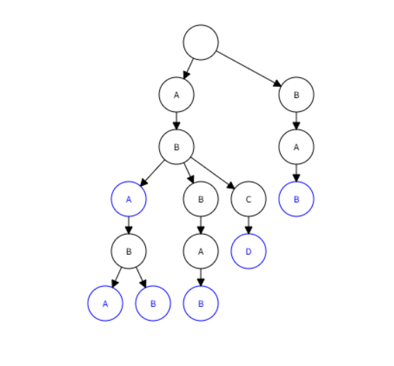
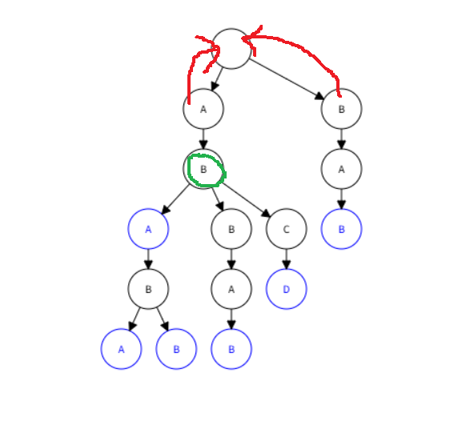
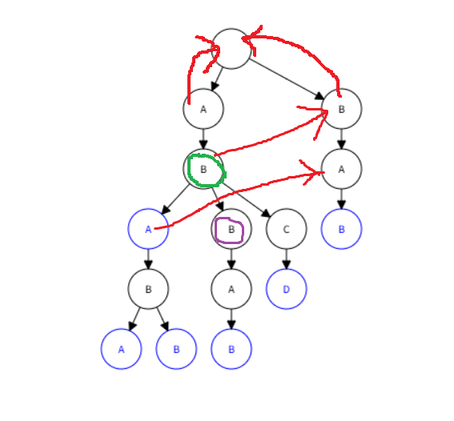
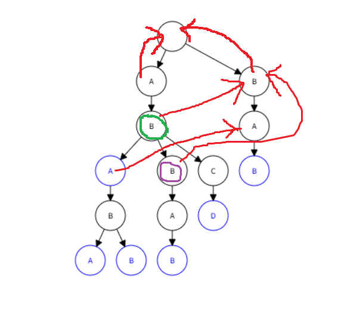
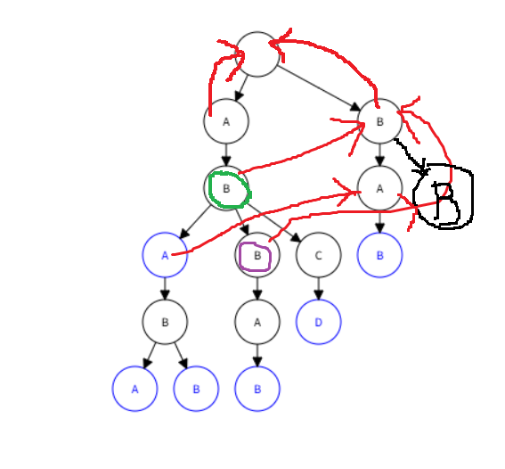

# 长河乱语 六

OTTF 2025 1 17 起写

OTTF 2025 6 26 终写

## 第0章 引子

“河流从山连接到海，而且有响声，所以河是琴弦。”

“这是，”沃柔德看着河面，听着背后传来的声音，“你的哲理吗？”、

“不，只是我想把身边的事物与string联系起来。”

“好吧，这是你的英语笑话……”

## 第1章 字符串

> 幸甚至哉，歌以咏志。
>
> ——和乐时的套语

我们跟数字打了很长时间交道，是时候该跳出去一会儿了。啊——计算机不会只能处理数字，不能处理汉字、拉丁字母等文字吧？不会吧？不会吧？嗯，这确实是荒谬的，因为能处理数字就能处理文字。如果想要用计算机处理文字，我们只需要制定一套所需要使用的字符和其在计算机内部所对应的数字的具体标准就可以了。比如说，一群美国人制定了包括阿拉伯数字、英文使用的拉丁字母、一些符号等128个字符所对应的数字的具体标准，并称之为“美国信息交换标准代码”，简称“ASCII”。此外，还有包括了中文的GBK、包括了世界上很多字符的UTF-8等具体标准。不过在ASCII中的字符的操作较为简单，而操作其他字符时可能由于标准不一致而出现问题，这成为了算法爱好者们研究字符串时多使用英文字母串的原因之一——另一个是：在计算机发展初期，很多算法研究者是英语使用者。

既然能操作字符，我们当然能把各种字符串起来，从而组成——呃——字符串。比如说，`"ABCDE"`——忽略双引号，我用它表示“字符被串起来、包裹起来”——就是一个字符串。你或许感受到了：字符串本质上也是一列元素，即一列字符。这使得对字符串有效的算法实际上对任何数组都有效，不过实际上我们还是习惯找些字母组成串串。同时，很多编程语言都会特殊对待字符串，比如有些语言会在已经有数组的情况下单独推出一个字符串类型。我们可以在伪代码中也特殊对待字符串……嗯……我想好了！`一个字符ch，一开始为'A'`可以用来定义一个字符，而`一个字符串str，一开始为"ABCDE"`可以被用来定义一个字符串。可以注意到，我用单引号来包裹单个字符，而用双引号来包裹一个字符串，这是从一些编程语言沿袭来的传统。

在未来的一段时间，我将讲述各种跟字符串有关的算法。而现在，我想讨论一些简单的话题——字符串的比较。是的，我们希望像比较数字一样去比较字符串的大小。显而易见，我们是在定义字符串的比较方式，并且我们应该先定义字符的比较方式。嗯，不如使用前人的智慧吧！ASCII中有很多字符，其中我们关心的是大小写英文字母。在ASCII中，大小写字母各自都按字母表中的顺序依次排列，并且所有大写字母都小于小写字母——后半句貌似没什么道理，我觉得反过来也说得过去。既然这样，不妨再规定一下我们讨论的字符串只包含大写字母，从而让问题更简单。

如果你翻阅过英语字典，你就会知道单词在字典中的排序方式：第一个字母小一点单词的排在第一个字母大一点的单词的前面；如果第一个字母一样，那就按照第二个字母接着排，后面以此类推；没有字母的地方视为比任何字母还小的字母。按照这种方式，如果我们把“排在前面”视为“小于”，就可以写出`"ALICE" < "BOB"`，`"ALICE" < "AN"`，`"A" < "ALICE"`。这种与字典类似的比较方式被称为“字典序”，它是很多人喜欢的排序方法。但是，有些时候我们需要让短字符串小于长字符串，而只对相等的字符串进行逐一的字符比较。在这时，我们可以得到`"BOB" < "ALICE"`，`"AN" < "ALICE"`，而`"A" < "ALICE"`是不变的。这种优先按长度比较的方式也比较常见，但我们接着拿字典序来研究比较问题。

按照字典序去比较字符串十分简单，在此之上，我们不难引申出一个问题——字符串排序。如果我们有很多字符串，想要把它们按照字典序排号，该怎么做呢？啊哈！我们不是学过排序吗？随便拿一个就可以了！嗯，有一点道理的想法，但是以前我们排的是整数，而现在我们排得是字符串。想起来了吗？在很多排序中，我们都涉及到了交换两个数这样的操作。整数很容易交换，时间复杂度是$O(1)$；而字符串有点长，如果它们之中最长的字符串的长度为$m$，那么时间复杂度就是$O(m)$——交换两个东西所用的时间肯定取决于它们有多大嘛！——好吧，我解释一下：交换两个东西时，设它们分别占据A和B两块空间，我们会在开始时再开辟一块新空间C；然后，我们把A中的东西挪到C，再把B中的东西挪到A，最后把C中的东西、也就是最初的A中的东西挪到B；可见，交换东西其实就是挪东西，而挪长长的字符串所需要的时间与它的长度几乎成正比，所以交换字符串所需要的时间也是这样。

如此看来，我们会在交换字符串时消耗很多时间，能不能优化一点呢？当然能，我们可以给每个字符串一个正整数作为编号，把编号们连成数组，然后排序这些编号，并且注意比较这些正整数的大小时其实要比较它们所对应的字符串。比如说，有`"ALICE" "BOB" "AN" "A"`这几个字符串，它们的编号分别是`1 2 3 4`。根据所对应的字符串排序后，这个数组会变成`4 1 3 2`。

但这还是消耗了太多时间！因为我们还有比较这个操作！容易想到，比较两个字符串也是$O(m)$的！这时，如果你自学过基数排序，你就肯定有了一个想法：像基数排序那样，一位一位排序。

好办法！首先，注视刚才的例子里的标号，我们首先要按照它们所对应的字符串的第一位排序。不难发现，第一位只有`'A' 'B'`两种字符，且排完后数组会变成`1 3 4 2`。然后，我们把数组分隔开，方式是第一位一样的要在一起，这就把数组变成了`1 3 4`和`2`。此时右边的那个小数组已经不用再进行排序了。不难想到，只要一直进行“对一块数组按照对应的字符串的某一位排序”，并“按照字符串中的这一位把数组分成更小的块”，并且保持这个“某一位”是从第一位增加到最后一位的，这样递归下去，就一定能把这些字符串排序！

如果你不知道什么是基数排序——你看，这就是基数排序。如果我们的字符串最长长度为$m$，而总共有$n$个字符串，那么这样的排序的时间复杂度为$O(nm)$。相比之下，如果使用其他排序，时间复杂度会是$O(m \times n \log n )$。显然，基数排序更优。

## 第2章 哈希

> 金风玉露一相逢，便胜却人间无数。
>
> ——秦观《鹊桥仙·纤云弄巧》

既然字符可以对应数，那么字符串可不可以对应数呢？当然可以。但在这之前，让我们思考一下什么才是“对应”。

在我们使用的体系中，对于单个字符，它肯定可以被对应成数，而且只能对应成一个数。比如说，在ASCII中，如果我们拿着`'A'`去对应，那么肯定只能得到`65`，因为表里就是这么写的。而每个字符对应的数都不一样，比如说既然`'A'`对应`65`，那么其他字符都不会对应这个数。这样的对应十分不错，因为在这样的规则下，我们不仅能在拿到一个`'A'`时知道它对应`65`，更能在拿到`65`时知道它只能从`'A'`对应来。

那么，我们想把字符串对应成数，也就是要找到一种数的计算方式，使得能在知道一个字符串时，算出一个这个串所对应的独一无二的数。该怎么算呢？如果你有一定的数学功底，或者是在看见前面的“进制”相关内容时了解过，肯定能想出答案。

暂时抛弃字符串，来看看$123$这个再普通不过的数，通过小学知识，它等于$1\times10^2+2\times10^1+3\times10^0$，因为$1,2,3$分别在百位、十位、个位上。这就是“十进制”，每一位上的数字实际上代表着这个数字乘上十的整数次方。啊哈！这种用进制表示数字的方法可以被套用到字符串！ASCII中有256个字符，我们把每个字符串都用二百五十六进制转换成数，比如`"ABC"`就会变成$65\times256^2+66\times256^1+67\times256^0$。我使用$256$是因为我喜欢这个数，考虑到我们只处理大写字母，你也可以使用$26$。

这种处理方式会使得到的数很大，比如刚才的算式的计算结果是$4276803$。望着这样大的数字，我们不禁要问：这种把字符串转换成数的算法有什么用？换句话说，有什么事情是数能做而字符串不能做的吗？嗯，当然有。比如说，作为数组下标。如果我们有很多字符串，想要知道其中每一个出现多少次，我们就可以把它们转换成数来方便处理。具体来说是这样：

``` 伪代码
一列字符串strs，共n个字符串
一列数cc，共m个数
一列字符串real，共m个字符串

统计次数（）：
    对于strs中的每个str：
        一个数num，为 转换成数（str）
        cc[num] 为 cc[num] + 1
        real[num] 为 str
    
    i从1到m循环：
        如果 cc[m] > 0：
            输出（real[m]，"的出现次数是"，cc[m]）
```

注意，在把字符串转成数并在计数数组上做操作之余，我们需要存储下每个数所对应的字符串，这样才能在最后输出答案。不过你肯定想到了：由字符串转换来的数可能很大，万一数组无法那么大呢？你可能会向把$256$减小到$26$，但这无济于事，因为字符串有可能很长，使得转换来的数还是很大。为了让转换来的数小一点，我们可以把它对一个数取余。但显然，这会破坏我们对应的性质——可能会有两个不同的字符串对应到同一个数上。不过，如果我们的字符串足够少，并且选取的用来取余的字符串足够好，这种情况就更可能会避免。研究发现，比较大的质数是比较好的，不过由于我们现在需要把它作为数组下标，这个质数又不能太大。我认为，$10^7+19$就是一个不错的质数。

我们可以用下面的方法来将字符串对应成数，你会看到这种技术其实叫“字符串哈希”：

``` 伪代码
哈希（一个字符串str，长度为n）：
    一个数res，一开始为0
    一个数base，一开始为256
    一个数mod，一开始为10000019

    对于str中的每个ch：
        res 为 ((res * base) % mod + ch) % mod
    
    返回 res
```

注意到，我在运算过程中就取了余，这是因为取余——它在我们待会儿的公式里中写作$mod$——有着$(a+b) \mod p = (a \mod p) + (b \mod p)$以及$a \times b \mod p = (a \mod p) \times (b \mod p)$这两个类似分配律的性质，所以我可以把原本应该在最后进行的取余操作放到前面的计算中。

有了哈希，我们就能为它找到很多应用场合——这看起来像个玩笑，但实际上，有些时候确实是先有知识再有应用场合。我们可以用哈希来判断两个字符串是否相等，具体来说，只要判断它们的哈希值是否相等就好了。我知道，你或许还因“可能会有两个不同的字符串对应到同一个数上”而提心吊胆，实际上，这种事叫做“哈希碰撞”。为了避免哈希碰撞，科学家们相处了一些好点子。比如我们可以使用“多重哈希”——用不同的模数来计算哈希值，这样，发生哈希碰撞的概率会变得更低。

## 第3章 查找子串

> 有容，德乃大。
>
> 《尚书·君陈》。

很容易就能想到，在一个很长的字符串中寻找另一个小一点的字符串是一个重要的操作，比如在`"FANFUCKINGTASTIC"`这样的单词中寻找有没有脏话中缀。所以，让我们来看看处理这个问题的算法。

为了方便，我们将较长的那个串称为“文本串”，或者说$txt$；而将较短的那个串称为“模式串”，或者说$pat$。现在需要在文本串里寻找模式串。显然，一个朴素的暴力做法是枚举文本串中模式串可能的开始位置，然后向后判断两个串的对应位置是否相同。我们设文本串长度为$m$，模式串长度为$n$，那么这个做法的时间复杂度就是$O(mn)$。

可是用刚才的例子来试验一下，你会发现我们好像寻找得相当容易：`"FANFUCKINGTASTIC"`中甚至只有两个`'F'`，所以我们只会从两个位置开始往后比对字符串。这暗示我们，这个比对或许能浪费更多时间，只是我们没有碰上。很容易想到，如果文本串是`"AAAAABAAAAAB"`，而模式串是`"AAAB"`，那么我们会在比对上浪费很多时间。因为我们会将很多个`"AAA"`成功匹配，而在模式串中`'B'`这个字符上发现不匹配——或者说“失配”。

想象你把这两个字符串写到了一张纸上，文本串在上面，模式串在下面，它们的字符一一对应，你通过不断右移模式串来寻找文本串中有没有模式串。同时，我们让一个小星号帮我们标记我们匹配模式串的字符到了哪里。开始时，大约是这样的场景——没有星号是因为我们还没有匹配：

``` 字符艺术
AAAAABAAAAAB
AAAB
```

第一次发现失配时则是这样的场景：

``` 字符艺术
AAAAABAAAAAB
AAAB
   *
```

使用刚才的暴力算法，你下一步做的应该是这样的匹配：

``` 字符艺术
AAAAABAAAAAB
 AAAB
 *
```

对吧？但是想一想——这个匹配真的是必要的吗？拿$str_i$这样的下标表示法来表示字符$str$中的第$i$个字符，我们在先前成功的匹配中知道了$txt_2$与$pat_2$相等，而现在我们想要知道$txt_2$与$pat_1$是否相等，显然这个问题与“$pat_1$是否与$pat_2$相等”等价。这启发我们，如果预处理出字符串中一些字符的相等关系，或许就能跳过一些匹配。

我们好像还是没什么头绪，因为相等关系的暴力预处理是$O(n)$的，不是很好。而要直接运用这些关系也不是很容易。为了找到更多想法，我们来接着研究问题：在得知$txt_2$与$pat_1$的匹配结果后，我们想知道$txt_3$与$pat_2$的研究结果，也就是进行：

``` 字符艺术
AAAAABAAAAAB
 AAAB
  *
```

用刚才的方法，这个问题相当于“$pat_2$是否与$pat_3$相等”。我们发现我们推出的这两个问题好像可以合并成一个问题——如果用$str_{i,j}$表示字符串$str$中第$i$个字符到第$j$个字符组成的一段，那么显然这两个问题可以被合并成“$pat_{1,2}$是否等于$pat_{2,3}$”，而这个问题的答案是“是”。也就是说，只要我们知道$pat_{1,2} = pat_{2,3}$，那么我们就能跳过$2$次匹配。

你或许已经发现了什么，但我要再举一个例子：把模式串换成`"AAAABAAAA"`，文本串不变，在进行下面的匹配之前，你肯定会先敏锐的发现什么：

``` 字符艺术
AAAAABAAAAAB
 AAAABAAAA
  *
```

啊哈！我们一眼就看出$pat_{1,3} = pat_{2,4}$，套用刚才的逻辑，这使得我们可以跳过$3$次匹配。现在，我们来诠释一下这个式子到底是什么意思。我们可以说：这个式子相当于把模式串中前$4$个字符`"AAAA"`单拎出来，然后寻找了一个数$num$，使得这$4$个字符的前$num$个字符等于后$num$个字符，显然在这个式子中$num$等于$3$。显然$num=4$也能满足这个条件，但这并没有什么作用，所以我们应该把$num$不等于单拎出来的字符数也作为限制条件。那么现在问题来了：为什么拎出来的字符总共有$4$个？

回顾我们之前的思考过程，你会发现，这是因为我们已经通过上一轮匹配获得了“$txt_{1,4}=pat_{1,4}$”这个重要信息，这可以被重述为“$pat_{1,4}$与文本串中的一段相等”，更可以被重述为“我们刚才一直成功匹配到了第$4$个字符”或“我们刚才在第$5$个字符失配”……你肯定知道了，我们可以预处理出数组$\pi$——它跟圆周率没什么关系，但这是很多人使用的名字，我也想用——使得$str_{1,i}$的前$\pi_i$个字符与后$\pi_i$个字符相等，而且$\pi_i \neq i$；然后我们拿着$\pi$数组去匹配，每次失配并开始新一轮匹配时就运用它来跳过一些匹配。具体来说，如果我们让一个数组`res`存储每个寻找到的模式串的起始位置并作为答案的话，伪代码是这样：

``` 伪代码
一个字符串pat，长度为n
一列数pi，长度为n

查找子串（一个字符串txt，长度为m）：
    一列数res，一开始长度为0
    一个数j，一开始为1

    i从1到m循环：
        重复执行，如果 j > 1 且 txt[i] 不等于 pat[j]：
            j 为 pi[j-1]+1
        如果 txt[i] = pat[j]：
            j 为 j+1
        如果 j 为 n+1：
            res 末尾添加 i-j+2
            j 为 pi[j-1]+1
    
    返回 res
```

其中有一个大循环，使用的`i`和`j`都表示将要匹配的字符的编号。大循环里的小循环用来处理失配状况，我们不将`j`重新置为`1`，而是利用它的$\pi$值，这个小循环会在`j`已经是`1`或者匹配成功时停止。然后，如果是匹配成功的情况，我们增加`j`并进行是否配完的检查。

顺带一提，我们额外规定$\pi_0=\pi_1=0$，这让我们可以处理一些边界情况。

现在，唯一的问题是如何计算`pi`数组，这个问题可以用递推来解决。让我们再使用一个新的模式串`"ABABAA"`，假设我们已经计算出了前$4$个$\pi$值——这话说起来好怪——需要计算$\pi_5$。把这个情景用字符表示出来，上面是用空格分割的字符串而下面是$\pi$值，就是：

``` 字符艺术
A B A B A A
0 0 1 2
```

与$\pi_5$最近的$\pi$值是$\pi_4$，而$\pi_4=2$，这表示$pat_{1,2}=pat_{3,4}$。可以想到，如果这两段后面的字符也相等，即$pat_3$还等于$pat_5$的话，就有$\pi_5=\pi_4+1$。而事实确实是这样，$\pi_5=\pi_4+1$，也就是$3$。

``` 字符艺术
A B A B A A
0 0 1 2 3
```

我们再来尝试计算$\pi_6$。当我们在$pat_{1,3}=pat_{3,5}$的基础上比对$pat_4$与$pat_6$时，我们遗憾地发现它们并不相等。但是，我们又想继续利用$\pi$带来的便利性——我们还想获得一个新$num$，使得前$5$个字符的前$num$个和后$num$个相等，而且$num < 3$，或者说$num < \pi_5$，因为利用$\pi_6$的一次比对已经失败了，我们需要一个新的$\pi_{num+1}$。该怎么获得$num$呢？实际上，我们应该让新$num=\pi_3=1$，这是为什么呢？由于$\pi_3=1$，我们知道$pat_{1,1}=pat_{3,3}$；而由于$\pi_5=3$，我们知道$pat_{1,3}=pat_{3,5}$，其中肯定有$pat_{3,3}=pat_{5,5}$：所以$pat_{1,1}=pat_{3,3}=pat_{5,5}$，即$1$是我们需要的新$num$。当然，$pat_2$依然不等于$pat_6$，我们需要再将$num$设为$pi_1$，也就是$0$，我们发现$pat_1=pat_6$，所以$\pi_6=1$。

按照这样的想法，我们能写出$\pi$值的计算方法：

``` 伪代码
一个字符串pat，长度为n
一列数pi，长度为n

计算pi值（）：
    一个数j，一开始为1

    i从2到n循环：
        重复执行，如果 j > 1 且 pat[i] 不等于 pat[j]：
            j 为 pi[j-1]+1
        如果 pat[i] = pat[j]：
            j 为 j+1
        pi[i] 为 j-1
```

这一长串算法由D.E.Knuth，J.H.Morris和V.R.Pratt共同提出，我们可以叫它KMP算法。KMP算法的时间复杂度是$O(m+n)$：在`查找子串`中最多的操作肯定是关于`j`的，它最多能被加$m-1$次，所以也只能被减这么多次；`计算pi值`中同理，只是把$m$换成$n$。顺带一提，各种“前几个字符”“后几个字符”的说法可以用“前缀”“后缀”代替，即一个字符串的“缀”指的是连续且一个边界是此字符串的边界的小字符串。

我们也可以用字符串哈希解决这个问题，只需要实现$O(1)$的$txt$内的每一段的哈希计算，然后用$pat$的哈希值比对$txt$内长度与之相同的每一段的哈希值就可以了。该怎么实现呢？我们先$O(n)$预处理出$txt$所有前缀的哈希值，根据我们使用的哈希值的定义，如果用$hash_i$表示长度为$i$的前缀的哈希值，那么$hash_i=hash_{i-1}*256+txt_i$。因为这两个哈希值的区别除了$hash_i$加了$txt_i$这个字符而$hash_{i-1}$没有外，就是前面的字符所乘的$256$的系数hash_i要比$hash_{i-1}$大。然后，用$hash_{i,j}$表示$txt_{i,j}$的哈希值，自然有$hash_{i-1} \times 256 ^ {j-i+1} + hash_{i,j} = hash_j$，你可以自己推导一下。

这样一来，我们也可以使用字符串哈希来解决这个问题，只是需要尝试避免哈希碰撞。

## 第4章 字典树

> “不可能”三个字，是我字典中所没有的。
>
> ——拿破仑

有一列字符串，这个列的名字为$strs$；还有字符串$str$，我们想要知道$str$是否在$strs$中出现过，如果出现过，又出现了几次。并且我们会有很多个$str$来进行询问，总共有$q$个。这个问题可以怎么解决呢？

我们会想到KMP算法，即把$strs$里的所有字符串拼起来作为文本串，然后将$str$作为模式串跑一遍KMP。但如果$strs$中有`"CAR"`与`"PET"`，被拼接成了`"CARPET"`，而$str$为`"CARPET"`，那么我们会在拼接后的字符串中找到$str$，但其实这是错的。

但是，我们还可以补救一下，即在每两个字符串中添加“挡板”，比如`"CAR"`与`"PET"`可以被拼接成`"CAR#PET"`。“挡板”可以是任何不在$str$中的字符，由于我们只考虑大写字母，我们可以把井号作为挡板。这样，我们就可以用每次$O(q \times (m+n))$的时间解决这个问题，其中$m$是$strs$中的字符串的长度之和，$n$是$str$的长度。

这看起来是挺好的，但是我们可以用一种截然不同的方法做得更好。先忘掉KMP这个比较优的算法，想象一下解决这个问题最暴力的方法是什么：啊，是拿着$str$在$strs$中一个一个比对，从而统计答案，这是很慢的算法。这主要是因为我们在比对时是在被动地发现两个字符不相等，如果每次我们都尝试找到$strs$中的几个字符串，使得它们的前缀与$str$的对应前缀相同，并且一个字符一个字符扩展前缀，扩展完时看看找到的这些字符串的长度是否与$str$相同，或许会好很多——这好像有些天马行空，但是，让我们接着想下去。

就比如说$str$是`"ABC"`，其中长度为$1$的前缀是`"A"`，我们有什么对$strs$的处理能知道$strs$中有没有出现过前缀`"A"`吗？或者扩展一下，对于单个字符组成的字符串，我们能用什么方法获悉$strs$中有没有出现过这样的前缀吗？确实能，我们可以建立一列有$26$个元素的数组，每一项分别代表每个字符出现的次数，只需要预处理一下就可以了。而对于前缀`"AB"`呢？我们好像可以建立长度为$26 \times 26 = 676$的数组，但仔细想一下，我们其实可以让刚才的长度为$26$的数组的每一项再指向一个长度为$26$的数组，每一项代表其上面的字符和它自己组成的前缀出现的次数。比如首先有一个数组`num`，它的第一项不仅存了前缀`"A"`出现的次数，还指向了一个数组`numA`；而`numA`的第二项则存了前缀`"AB"`出现的次数。这个逻辑还可以继续嵌套下去，最终，我们能得到类似这样的无穷无尽的一堆数组——我为了方便只考虑了`'A'` `'B'` `'C'`三个字母。

``` 字符艺术
        A                 B                 C
   /    |    \       /    |    \       /    |    \
  A     B     C     A     B     C     A     B     C
 /|\   /|\   /|\   /|\   /|\   /|\   /|\   /|\   /|\
A B C A B C A B C A B C A B C A B C A B C A B C A B C
...
```

在这之中，我们看到了纵向排列的一堆前缀，以及横向排列的一堆数组。不过，你肯定还看见了很多树吧！确实，我们刚才的行为其实就是建立了几棵树，而且如果你凭空捏造出一个点来连接上面的几个点，你还能把它们统一成一棵树。

既然认识到了这是一颗树，我们就可以缩减它的规模——其中很多节点都是无用的，我们考虑只创立有用的节点。不难想到，可以对照着$strs$中的字符串逐个创立。比如，如果其中只有`"ABA"`和`"ABC"`，我们就只形成：

``` 字符艺术
  *
  |
  A
  |
  B
 / \
A   C
```

这样一来，我们拿着字符串$str$就能判断它是否作为前缀在$strs$中出现过——注意，是作为前缀。我的意思是，按照我们刚才的树，我们也能找到`"AB"`这个前缀。当然，我们还想要判断这个前缀是否是$strs$中的整个字符串。为了满足这个需求，我们可以在构建这棵树时在字符串末尾对应的节点打上标记——在刚才的例子中，就是下面的`'A'`和`'C'`两个字符。仅当顺着$str$查找完且最终停留在一个有标记的节点时，我们才知道$str$在$strs$中出现过。想要知道出现次数也很简单，我们可以把这个标记改成该节点最为末尾的次数。

或许你想知道这种树应该如何生成，如果你还记得指针的话，就可以这样做：一开始只有树的最顶端的节点，它包含着一个数组，数组的每一项都是一个指针，对应这个节点的子节点们；但是这些指针一开始都是空指针，没有被开辟空间，只有需要用到一个节点时，才会去开辟它对应的空间；从最顶端的节点到下面的节点，都是这样的储存方式；当然，每个节点还要存下到它那里截止的字符串的次数标记。

还有一种更简单的方式：直接开一个长长的数组，里面的每一项都对应一个节点，并且都还是一个数组，其每一项都是个数组编号，对应着该节点的子节点；你可以随便钦定一个数字，让它当作树最顶端的节点。如果你不明白我刚才两下说了什么，请继续下去。

总而言之，我们可以用这种数据结构把很多字符串组合起来，从而使得每次检查某个字符串的出现次数时能够得心应手。这种数据结构叫做字典树。当然，这个问题其实还可以用字符串哈希来解决，你可以自己去试一试。

## 第5章 自动机

> 善攻者，动于九天之上。
>
> ——《孙子兵法》

KMP算法可以查找模式串在文本串中出现了几次，字典树可以组合很多字符串，我们不禁要问：我们可以查找很多模式串在某一个字符串中出现几次吗？当然可以！科学家Alfred V. Aho与Margaret J.Corasick把这两个算法结合起来，发明了一种处理这个大问题的算法。

我已经把整个算法的一半暴露给你了——看起来我们需要把模式串们放到字典树里。现在，我给出一个字典树的代码：

``` 伪代码
一个整数cc，一开始为1
一列元素tree，一开始长度为1，每个元素是一个数组，长度为26
一个数组stop，一开始长度为1

插入（一个字符串str，长度为n）：
    一个整数now，一开始为1
    i从1到n循环：
        如果 tree[now][str[i] - 'A' + 1] 为 0：
            cc 为 cc+1
            tree[now][str[i] - 'A' + 1] 为 cc
            tree末尾添加一个数组
            stop末尾添加0
        now 为 tree[now][str[i] - 'A' + 1]
    stop[now] 为 stop[now] + 1

查询（一个字符串str，长度为n）：
    一个整数now，一开始为1
    i从1到n循环：
        如果 tree[now][str[i] - 'A' + 1] 为 0：
            返回 0
        num 为 tree[now][str[i] - 'A' + 1]
    返回 stop[num]
```

在这段代码中，`cc`告诉我们现在字典树中有多少节点，我们把节点`1`作为一开始的节点，同时也是树的根节点。`tree`就是我们说的字典树，可以看见我使用了刚才说的第二种实现方式。而`stop`表示了每个节点处代表着多少个字符串的末尾。注意到我多次写下了`str[i] - 'A'`，这与我们之前提到的字符的表示方法相关——`str[i]`是一个`'A'`到`'Z'`的字符，但其实也是一个数，把它减去`'A'`再加上`1`，就能得到一个`1`到`26`的数，与我们想要的序号相合。

现在我们把很多字符串放在一起了，之后要查找它们是否在某个字符串中出现，联想到KMP中的起名方式，就叫这个字典树“模式树”吧。在KMP中，我们为应对字符串匹配失败的情形而对模式串创造了$\pi$数组，表示对于某个字符串前缀，它的某对前缀和后缀相等。既然这样，我们直接类比——如果对模式树建立一个类似的$fail$数组，肯定能方便解决问题吧！

确实是这样！不过模式树上$fail$数组的建立又与模式串上$\pi$数组的建立有所不同——什么叫“类似的$fail$数组”呢？我还没有给出它的定义呢。让我对着这个例子来说明一下：



这是一棵字典树，根节点是那个空白的圈，其它的圈就是其他节点。考虑根节点的两个子节点，它们的$fail$数组可以指向哪里呢？哦，$fail$数组是帮助我们处理失配情况的，使用这两个节点的$fail$数组表示我们刚开始就失配了，我们自然应该让它帮助我们回到根节点。在这张修改后的图中，红色箭头是某些$fail$数组表示的神奇路径：



你还能看到我把某个节点标绿了，这是因为我要考虑它的$fail$。让我们想想：从根节点到这个绿点的路径表示着字符串`"AB"`，如果我们拿着它长度为$2$的后缀`"AB"`去往上找——就像做KMP时往前找前缀一样——我们找不到其他这样的前缀了，毕竟我们现在就在很上面的位置嘛。不过，如果我们放宽要求，我们就能发现这个节点上面存在一个与长度为$1$的后缀`"B"`相同的前缀——就在根节点下面！啊，某个前缀等于某个后缀，熟悉的感觉，或许我们应该让$fail$数组表示这种指向。

怎么大量生成这种$fail$呢？注意到根节点的子节点的$fail$表示的是两个空缀的相等，按我们刚才的定义肯定成立。而如果把两个相等的缀都加一个相等的字符，那么两个新缀也肯定相等。诶？我们怎么找到这种“添加相等字符”的情况呢？可以想到，如果能持续找到这种情况，就能慢慢处理出在每个节点的$fail$了。

啊哈！每一个$fail$代表两个节点的关系，我们认为它们是$f$——上面的点，以及$u$——下面的点。如果节点$f$有某个表示加上字符$c$的子节点$f'$，而节点$u$有某个表示加上字符$c$的子节点$u'$，那么节点$f'$和节点$u'$也应该有这样的$fail$关系！比如说这张图中新增的红箭头就可以这么得出：



既然有这种不错的情况，肯定就有差一点的情况。如果节点$u$有某个表示加上字符$c$的子节点$u'$，而节点$f$没有某个表示加上字符$c$的子节点$f'$，该怎么做呢？看那个紫色节点，它是绿色节点的子节点，但绿色节点的$fail$指向的那个点并没有指向`'B'`的子节点，我们应该怎么应对呢？

诶！虽然但绿色节点的$fail$指向的那个点并没有指向`'B'`的子节点，但绿色节点的$fail$指向的那个点的$fail$指向的那个点有啊。我们可以这么指：



可以联想到，如果某个点进行了两次这样的迭代还是无法形成$fail$，就可以进行三次迭代，乃至更多迭代。这当然是对的，但更是有些费事的。有没有什么不进行多次迭代的方法吗？诶！既然节点$f$并没有表示加上字符$c$的子节点，那我们就能在那个位置为所欲为！我们现在把$f$的$fail$指向的节点叫做$ff$，然后让$f$的其实不存在的表示加上字符$c$的子节点指向$ff$的表示加上字符$c$的子节点。



我们把这种进行迭代的红色箭头拆成了几部分！在这个例子中，那个弯曲的红色箭头被一个其实不存在的虚假节点一分为二，上下方都各自是一个很正常的红色箭头。

整理我们的思路，我们只需要按层遍历这棵树，然后创造一些红色箭头并伪造节点，就可以完成$fail$数组的建立。

``` 伪代码
一列数fail，一开始长度为tree的长度

计算fail值（）：
    一个队列q，一开始没有元素
    i从1到26循环：
        如果 tree[1][i] 不为 0：
            fail[tree[1][i]] 为 1
            q 添加 tree[1][i]
    重复执行，如果q不为空：
        一个数u，为q的队首
        q删除队首
        i从1到26循环：
            如果 tree[u][i] 不为 0：
                fail[tree[u][i]] 为 tree[fail[u]][i]
                q 添加 tree[u][i]
            否则：
                tree[u][i] 为 tree[fail[u][i]]
```

有了字典树和$fail$数组，我们就可以轻松地写出匹配代码了。注意我们强行规定只需要求出文本串一共中出现了几次模式树中的模式串，这貌似并没有什么用。不过当然现实运用中我们额可以创造更多用途，现在只需要了解这一小段代码的精神就可以了：

``` 伪代码
一个数res，一开始为0

查找很多子串（一个字符串str，长度为n）：
    一个数u，一开始为1
    i从1到n循环：
        u为tree[u][str[i] - 'A' + 1]
        一个数v，一开始为u
        重复执行，如果 v 不为 0：
            如果 stop[v] 不为 0：
                res 为 res + 1
            v为fail[v]
```

看，每当我们知道文本串中出现了模式树中的一段字符路径，这段路径的每个前缀对应的字符串都有可能在文本串中出现了——只要它们的末端是字符串的结尾——我们可以用$fail$数组找到它们。所以我们能写出这个代码。

这个算法叫做什么呢？它叫做AC自动机。为什么呢？你看，在我们添加$fail$的字典树中，当在模式树中的某个节点匹配到某个字符时，我们有一个确定的路径去经过，从而到达下一个节点。对于这种根据现在所处的情况而有一个确定反应的思维工具，计算机科学家们叫它“自动机”。这个由Alfred V. Aho与Margaret J.Corasick发明的算法便叫AC自动机。

## 第6章 回文串

> 败落孤岛孤落败。
>
> ——据说出自拿破仑

我们已经讨论了几个关于普通字符串的问题，现在让我们关心一种特殊的字符串——回文串。

回文串指的是正着看和倒着看都一样的字符串，如果把字符扩展到汉字，那么`"蜜蜂的蜂蜜"` `"刷牙用牙刷"`都是回文串；而对于我们讨论的英文大写字母，`"NOON"` `"LEVEL"`都是回文串。对于长度为$n$的字符串，你肯定能想到判断它是否为回文串的方法：遍历每个字符，对于第$i$个字符，看看它是否与第$n-i+1$个字符相同就好了。

这个问题还是太简单了，我们考虑一个更大的问题：首先，对于一个字符串，我们在每两个字符中间以及字符串的两边插上“栅栏”，这些“栅栏”都是不在我们讨论的字符集中的字符，比如`"LEVEL"`就可以变成`"#L#E#V#E#L#"`这个新字符串；然后问题来了，对于每个字符$str_i$——不管它是不是栅栏——我们求出它的$d_i$，其表示$str_{i-d_i+1,i+d_i-1}$是一个回文串，而$str_{i-d_i,i+d_i}$不是。

求回文串的方法虽然不好想，但它的要求是好懂的——$d_i$也表示了以$str_i$为中心的回文子串的数量，因为既然$str_{i-d_i+1,i+d_i-1}$是回文的，那么更小的、中心相同的子串也回文。求$d_i$能让我们求出回文子串的总数。相比之下，插栅栏的操作就有些奇怪了。不过，如果你思考一下，就会发现插栅栏这一操作可以让我们考虑到在原本字符串里中心落在两个字符之间的回文串。比如`"NOON"`里的`"OO"`和`"NOON"`，这两个子串都是回文子串，我们有求出它们的想法，但如果单纯按照计算$d_i$的方法，它们不会被考虑。而如果在`"NOON"`里插栅栏，把它变成`"#N#O#O#N#"`，那么就中间的回文子串来说，`"#"` `"O#O"` `"#O#O#"` `"N#O#O#N"` `"#N#O#O#N#"`都会被考虑。

显然插栅栏会让回文子串的数量增多，我们来分析一下。还是对于`"#N#O#O#N#"`，对于第一个`'O'`，它的$d_i=2$，包括了`"O"`与`"#O#"`——显然对于以同一个位置为中心的回文串，如果此位置是普通字符，那么这些回文串的个数为偶数，且其中有一半的前后两个字符是栅栏，我们把$d_i$除以二就能得到真正的回文串数量。而如果中心是栅栏，就像上面的例子一样，回文串数量$d_i$是奇数，其中有$\frac{d_i+1}{2}$的字符串的外围是栅栏——由于我们认为除法一般会向下取整，还是把$d_i$直接除以二就好。

讨论如何计算$d$。想象我们已经计算了前$i-1$个$d$值，现在打算计算$d_i$，我们当然可以考虑最朴素的算法——从$str_i$开始一步步往外比对，算出最长的$str_{i-d_i+1,i+d_i-1}$，就像这样：

``` 伪代码
一个字符串str，长度为n
一列数d，长度为n

回文串（）：
    i从1到n循环：
        重复执行，如果 (1 小于等于 i-(d[i]+1)+1) 且 (i+(d[i]+1)-1 小于等于 n) 且 (str[i-(d[i]+1)+1] 等于 str[i+(d[i]+1)-1])：
            d[i] 为 d[i]+1
    返回 d
```

注意到，我使用了`i-(d[i]+1)+1`这个长长的表达，其实它是用`(d[i]+1)`替换了`i-d[i]+1`中的`d[i]`，如此做是因为我们需要判断`(d[i]+1)`是否是合乎回文串要求的`d`，如果是就把`d[i]`变成这个值。显然`i-(d[i]+1)+1`与`i+(d[i]+1)-1`可以被写成`i-d[i]`与`i+d[i]`这两个更简单的形式，我在之后打算这么做。

我们当然要想出更快的方法了，就像KMP算法中的`pi`数组一样，想一想`d`数组能为我们带来什么。比如在处理`"#A#B#A#C#A#B#A#"`时，我们能用`d`数组做什么吗？考虑处理第二个`'B'`的时候，我们把用空格分割的字符串及其下标和已经算出来的`d`数组的值列在这里：

``` 字符艺术
1  2  3  4  5  6  7  8  9  10 11 12 13 14 15
#  A  #  B  #  A  #  C  #  A  #  B  #  A  #
1  2  1  4  1  2  1  8  1  2  1
```

注意到，在我们计算这个`'B'`之前，已经有一个`d[8]`为`8`告诉我们$str_{1,7}$和$str_{9,15}$是正好相反的了。而在$str_{1,8}$这区间里，`d[4]`——也就是前面那个`'B'`的`d`值——是4，这表示$str_{1,7}$是回文的。欸！既然我们能得到$str_{1,7}$是回文的，那么我们就能知道$str_{9,15}$也是回文的！因为根据$d[8]=8$，我们知道它们是相反的，回文串反过来肯定还是回文串。

看起来我们好像可以根据老的$d$值直接获得新$d$值，但请看这个例子：

``` 字符艺术
1  2  3  4  5  6  7  8  9  10 11 12 13 14 15
#  A  #  B  #  A  #  C  #  A  #  B  #  D  #
1  2  1  4  1  2  1  6  1  2  1
```

这个字符串与上一个几乎相同，只是最后一个`'A'`变成了`'D'`。在前十一个$d$值的计算中，这让`d[8]`变成了`6`。所以，我们只能根据`d[8]=6`得到$str_{3,7}$和$str_{9,13}$是正好相反的。这使得我们虽然可以根据`d[4]=4`得到$str_{1,7}$回文，却只能采用更小的“$str_{3,5}$回文”的信息，因为我们知道$str_{1,7}$和$str_{9,15}$并不相等，不能用一边的回文信息得到另一边的。这里有一个图示：

``` 字符艺术
1  2  3  4  5  6  7  8  9  10 11 12 13 14 15
#  A  #  B  #  A  #  C  #  A  #  B  #  D  #
      -------------------------------         d[8]表示的一段回文子串
-------------------                           d[4]表示的一段回文子串
      -------                 -------         我们只能确定这两段是相等的
1  2  1  4  1  2  1  6  1  2  1
```

所以我们知道需要对老$d$值进行一些处理来获得新$d$值，但是这还没完，其实新$d$值可能更大，我们能做的其实只是为它找到一个下限，比如刚才的例子，在计算`d[1]` `d[2]` `d[4]`等$d$值时我们都会发现它其实比我们预料的要大。所以，在处理出$d$的下限后，我们其实应该在当前位置跑一下朴素算法——别慌，这不会让时间复杂度很坏。

还有一件事——刚刚我们的处理依赖于有一个涵盖当前位置的回文串，也就是对于$i$，有$j$使得$j+d_j-1 \geq i$。在此需要说明，如果没有这样的$j$，其实也就是我们只能处理出$d$值的下限为$1$，直接跑朴素算法就好。而如果有多个这样的$j$，我们需要选择$j+d_j-1$最大的，这是保证我们时间复杂度不错的关键。

我们的算法长成这样：

``` 伪代码
一个字符串str，长度为n
一列数d，长度为n

回文串（）：
    一个数j，一开始为0
    i从1到n循环：
        d[i] 为 1
        如果 j+d[j]-1 大于等于 i：
            d[i] 为 比较小（d[j+j-i]，j+d[j]-i）
        重复执行，如果 (1 小于等于 i-d[i]) 且 (i+d[i] 小于等于 n) 且 (str[i-d[i]] 等于 str[i+d[i]])：
            d[i] 为 d[i]+1
        如果 i+d[i]-1 大于 j+d[j]-1：
            j 为 i
    返回 d
```

现在我要告诉你，它的时间复杂度是$O(n)$，为什么呢？显然，如果我们用朴素算法让$d$值增大了$1$，那么在后面修改$j$时我们也会让$j$增大$1$。因为朴素算法就是在让回文子串的范围向外扩张，包括向右，而对$j$的修改就是在取右端最右的回文子串。由于显然$j$最多增长$n$次，那么朴素算法里的内容也最多运行$n$次，我们的时间复杂度就是$O(n)$。

这个算法由Edmund L. Manacher提出，被称为Manacher算法，或者如果你喜欢无厘头的谐音，也可以称之为“马拉车算法”。去除回文串的面纱，我们可以认为这个算法是在某个暴力算法之上做了一些优化来使时间复杂度不错，但保留暴力算法来保证正确性。如果你想要更多这样的算法，可以去搜索“Z函数”或者“扩展KMP”，它们指的是同一种算法。

## 第7章 后缀数组

> 青树翠蔓，蒙络摇缀，参差披拂。
>
> ——柳宗元《小石潭记》

或许计算机科学家们都是疯子，这里还有一个关于各种缀的算法——后缀数组。具体来说，我们想要快速地得到把某个字符串的每个后缀按字典序排序后得到的结果，即排序后关于各后缀的数组以及每个后缀的排名。显然，如果规定整个字符串是长度为$n$的$str$，只需要一个数$i$就能对应一个后缀$str_{i,n}$了。我们可以让$sa$数组储存排序后各排名上的后缀所对应的数，而$rk$数组储存每个数所对应的后缀的排名。比如说，当$str$为`"ABCAB"`，那么$sa$就是$4,5,1,2,3$，而$rk$就是$3,4,5,1,2$。

我们当然知道$sa[rk[i]]=i$与$rk[sa[i]]=i$，同时讨论这两个数组是因为其中的$sa$被明确规定为“后缀数组”，而$rk$则是计算其的辅助。该怎么计算后缀数组呢？

首先想到直接排序：如果使用快速排序，那么时间复杂度是$O(n^2 \log n)$；如果使用之前提到的基数排序，那么时间复杂度是$O(n^2)$。虽然基数排序确实很强，但是计算机科学家们想要让时间复杂度在平方级以下，因此就有了下面的尝试。

我们想到，每个后缀其实都可以看作是从某个位置延伸$n$位的字符串，只不过后面的几位可能是空字符，空字符小于任何字符。比如`"ABCDBDCC"`的后缀可以被这样列出来，其中圈圈表示空字符：

``` 字符艺术
ABCDBDCC
BCDBDCCo
CDBDCCoo
DBDCCooo
BDCCoooo
DCCooooo
CCoooooo
Cooooooo
```

我们把每个后缀的长度统一了，但这好像只是让某些后缀变长了一点，这有什么实际作用吗？当然有！可以看到，我故意选用了长度为$8$，即$2^3$的字符串，你是否想到什么呢？是的，递归分治！

我们慢慢来。把原有的字符串`"ABCDBDCC"`——记作$str$——添加上$8$个空字符，变成`"ABCDBDCCoooooooo"`——记作$str'$——我们的每个$8$位后缀就都是其中的一部分，比如`"DBDCCooo"`就是$str'_{4,11}$。显然，它由$str'_{4,7}$和$str'_{8,11}$这两个长度为$4$的子串组成。可以想到，在比较两个长度为$8$的子串的大小时，我们能轻松得出它们一分为二得出的两个长度为$4$的子串，只要知道了它们的大小关系，就能结合字符串的大小比较规则得知长度为$8$的子串的大小关系。看起来我们能分割出$16$个子串，但我们清楚地知道，其中会有在$str'$中位置重复的，不一样的子串只有$8$个——它的数值与长度为$8$的子串的都与$n$一样。我们可以先求长度为$4$的子串的大小关系并储存它们，在处理长度为$8$的子串的大小关系时直接使用储存过的关系来计算。更进一步地，如果$m>0$，把$8$换成$2^m$，把$4$换成$2^{m-1}$也能得到类似的结论。

这样递归下来后，我们就能反向想出递推的方案。首先简单地得出长度为$1$，即$2^0$的子串的大小关系，进而得出长度为$2^1$的、$2^2$的、$2^3$的……最后是想要的。注意到我们一直默认$n$是$2$的正整数次幂，其实如果它不是的话也可以如此解决，在分割字符串时还是从中间分割即可。我相信你可以自己想出伪代码。

计算机科学家可能是疯子，但也可能是务实主义者，我们知道后缀数组有很多实际应用，其中一个是文本串$txt$固定而模式串$pat$可变的字符串查找——又是子串查找！具体来说，如果$pat$在$txt$中，也就是说前者是后者的某个后缀的前缀。我们可以方便地得出$txt$的所有后缀排序后的顺序，然后在这些后缀中进行二分查找，查找前缀是$pat$的子串。这样我们就能得到$pat$在$txt$中的位置。

## 第-1章 结语

“你可以看到，我在最后偷了懒。这是变化的征兆。”

“什么变化？”

“敬请期待哦。”
