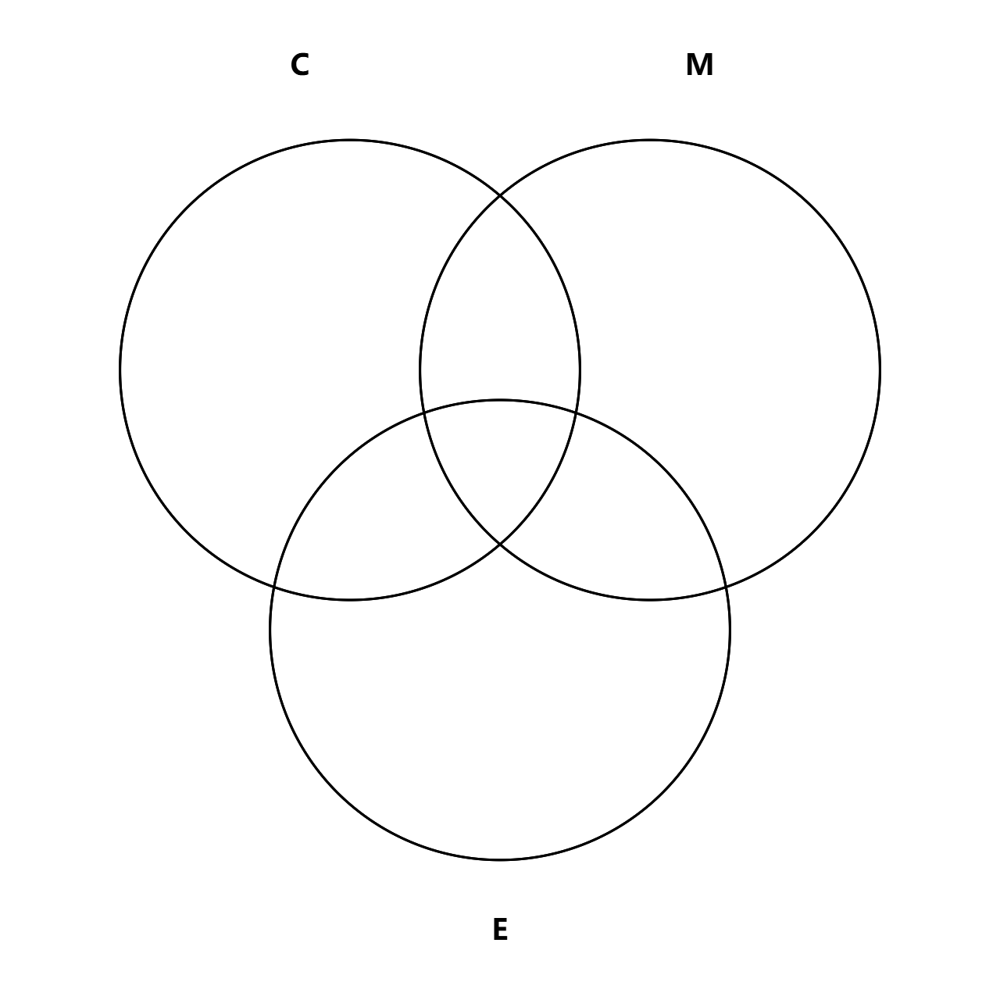
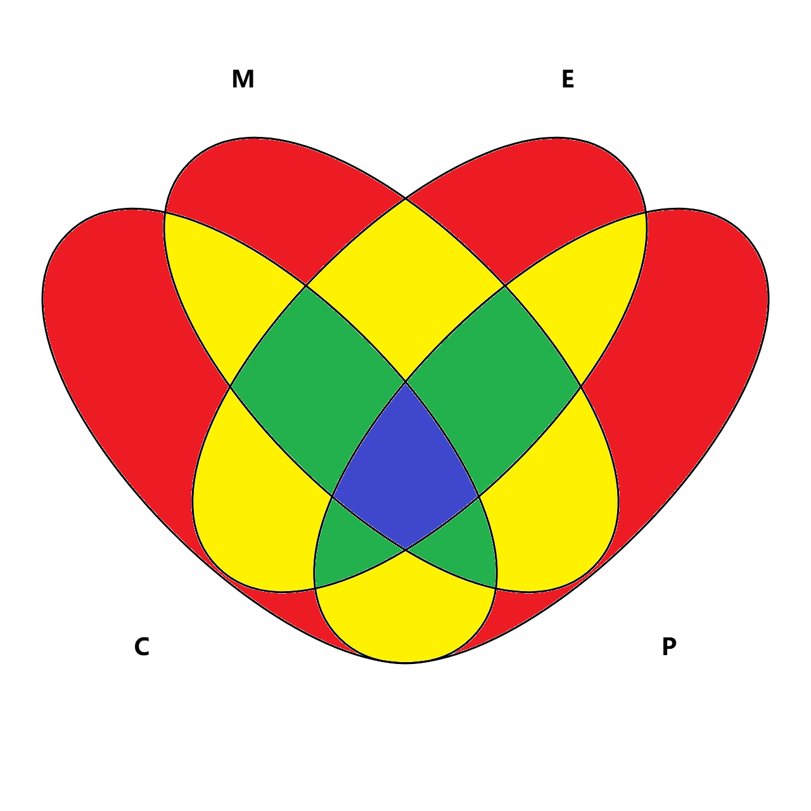

# 长河乱语 七

OTTF 2025 6 26 起写
OTTF 2025 7 10 终写

## 第0章 引子

看见何乐乌这次额外带了一支铅笔和很多纸，沃柔德很惊讶：“我没有想过今天会是这样。”

“那你现在可以开始想了。”何乐乌笑道。

## 第1章 算数

> 有匪君子，如切如磋，如琢如磨。
>
> ——《诗经·卫风·淇奥》

让我们从编程语言开始话题：你可能不了解编程语言，但你肯定知道在编程语言中，会有东西用来存储各种数据——就像在我的伪代码中一样——这种东西叫做“变量”。在很多编程语言中，每个变量都有自己的不可改变的“类型”，表示它储存的是什么数据。比如储存`114514`这个整数数据的变量就可能是“整数型变量”，而储存`'H'`这个字符数据的变量就可能是“字符型变量”——但这并不是定理，确实有些编程语言在变量类型上管得更宽一些——这不是我们的重点。

我想说的是，在某些编程语言中，整数型变量是有范围限制的，并不是想储存什么值就储存什么值。比如说，对于叫做“C++”的编程语言中的叫做`int`的整型，它的范围就被规定要至少是$-32768$到$32767$，但是很多计算机都有更强的能力，做到了$-2147483648$到$2147483647$的范围，我们现在也考虑这个范围。

二十亿多一点的绝对值在日常生活中不常见到，但确实可能在解决某些问题时出现。因此，众“C++”等对数据大小做出限制的语言的使用者就需要想办法用已有的语言工具表示范围更广的整数——称之为“大整数”，并创造对这种大整数进行基本的四则运算的算法——称之为“高精度计算算法”。顺带一提，某些语言能让我们不受范围限制地使用整数，其实是因为它们把这种大整数相关的处理内置到语言工具本身中了。

无论如何，我们都需要关心这种算法。对于大整数的存储，我们可以把大整数拆成一个个数字，然后把它放到数组里面。比如对于$112233445566778899$这个大整数，我们就可以用数组`{9,9,8,8,7,7,6,6,5,5,4,4,3,3,2,2,1,1}`表示——最低位在前而最高位在后，这有利于我们进行下一步的操作。而对于四则运算，我们则可以用类似列竖式的算法。如果我们想把刚才这个大整数与$11111111111$这个大整数相加，我们就可以把它们的数位一个一个写下来——注意是最低位在前而最高位在后，然后直接按数位相加：

``` 字符艺术
9  9  8 8 7 7 6 6 5 5 4 4 3 3 2 2 1 1
1  1  1 1 1 1 1 1 1 1 1
10 10 9 9 8 8 7 7 6 6 5 4 3 3 2 2 1 1
```

这就是我们列竖式的方式，只不过还需要处理一下进位——就像我们在小学做的那样就好喽。

``` 字符艺术
10 10 9  9  8 8 7 7 6 6 5 4 3 3 2 2 1 1
0  11 9  9  8 8 7 7 6 6 5 4 3 3 2 2 1 1
0  1  10 9  8 8 7 7 6 6 5 4 3 3 2 2 1 1
0  0  0  10 8 8 7 7 6 6 5 4 3 3 2 2 1 1
0  0  0  0  9 8 7 7 6 6 5 4 3 3 2 2 1 1
```

是的，我们从低位到高位处理进位，可以联想到如果这种处理来到了最高位，我们就需要得出一个新的最高位——比如`10 10`最终应该进位成`0 1 1`。这就是加法的高精度计算的全貌，知道了这些，相信你能在你的大脑和互联网的帮助下学会其它三种四则运算的高精度计算，毕竟它们其实都是小学内容。

容易想到，设参与四则运算的两个大整数的长度分别是$n$与$m$且$n > m$，如果使用小学列竖式算法去做整数的四则运算，加法和减法的时间复杂度是$O(n)$，而乘法和带余数的除法的则是$O(nm)$。其实乘法和除法都有巧妙的方法进行优化，但这里篇幅太小，说不下。

让我们进入初中水平，考虑大整数的乘方——有些人把乘方和加减乘除并称为“有理数的五则运算”。如果有底数$a$是个大整数，而指数$n$是个不大的正整数，我们当然可以用$O(n)$次大整数乘法进行$a^n$这个运算。但其实，我们还能更快一点。

注意到我们认为$n$是个不大的正整数——我承认我还是太渺小了，无法想象为什么两个大整数需要进行平方运算——也就是说它可以用二进制用至多三十二个数位表示出来。如果你还记得最近公共祖先的哪个部分，你可能还会记得：“任意一个非负整数都可以被表示成几个互不相同的2的非负整数次幂之和”。啊哈！对于$n$，我们可以把它拆分成很多个2的非负整数次幂，利用它们来快捷地求出答案。比如想要计算$a^{13}$——$a$作为复杂的大整数被我继续用字母表示——就可以去计算$a^{2^0} \times a^{2^2} \times a^{2^3}$，我们把这三个幂和被跳过的$a^{2^1}$放在一起，变成$a^{2^0},a^{2^1},a^{2^2},a^{2^3}$，可见每个幂都是前面的一个幂的平方。在计算时，我们可以拿着`a`这个变量一直求平方，同时判断是否要把当前的这个值算入答案。于是能得到这样的伪代码：

``` 伪代码
快速幂（一个大整数a，一个数n）:
    一个大整数res，一开始为0
    循环，当n大于0：
        如果 n % 2 不为 0：
            res 为 res * a
        a 为 a * a
        n 为 向下取整（n / 2）
```

你能看到这种算法叫做快速幂，这是因为它真的很快，只需要$O(\log n)$次的乘法运算，不管怎么样总是要比$O(n)$次的好点。

高精度算法和快速幂算法都是跟算数相关的算法，这是我们数学乐园中的第一个景点——欢迎来到数学乐园！

## 第2章 排列组合

> 也许多少年后在某个地方，
>
> 我将轻声叹息把往事回顾，
>
> 一片树林里分出两条路，
>
> 而我选了人迹更少的一条，
>
> 因此走出了这迥异的旅途。
>
> ——罗伯特·弗罗斯特《未选择的路》

如果有$5$个修理工，你要从中让$3$个修理工排队负责修理建筑中不同地方，你有多少种方法？明确一下，比如若有$1,2,3,4,5$这$5$名修理工，让$1,2,3$排队和让$1,2,4$排队显然是不同的，而$1,2,3$和$1,3,2$也是不同的，为什么呢？因为他们是要排队去做不同的事！比如$1,2,3$可能指的是“$1$修门、$2$修灯泡、$3$修窗户”，而$1,3,2$指的则是“$1$修门、$3$修灯泡、$2$修窗户”。

本质上我们就是在求从$n$个元素关心顺序地中选出$m$个的方案数，“关心顺序地”意为我们把顺序不同的写法算成多个答案，就像刚才$1,2,3$和$1,3,2$要被算成两个答案。这种问题的答案被称为“排列数”，用一个巨大的字母$A$和它的上下标表示，$A^m_n$就表示刚才的问题的答案。

一个聪明一点的小学生就能算出刚才的修理工问题的解：首先，我们从$5$个修理工中选出$1$个，有$5$种方案；然后，我们从剩下的$4$个修理工中选出$1$个，$4$种方案；最后，你肯定想到了，从剩下的$3$个修理工中选出$1$个，有$3$种方案。总共的方案为$5\times4\times3=60$种，把它们乘起来是因为选择每一种前面的方案都不影响选择后面的每一种方案，比如从$5$个修理工种选出一个后，你怎么着都得从$4$个修理工中再选一个。

你可以举更多例子，不管怎么样，你一定会发现$A^m_n=n(n-1)(n-2)\dots(n-m+2)(n-m+1)$，看起来我们可以把它当作最终结果，但是数学家们发明了另一种写法——$A^m_n=\frac{n!}{(n-m)!}$。

或许你知道那两个感叹号是什么意思，或许你不知道。不管怎样：$n!$表示的是$n$这个非负整数的阶乘，“阶乘”的意思是从它开始一直乘到$1$，即$n! = n\times(n-1)\times(n-2)\times\dots\times2\times1$。这样看来，我们可以知道数学家们想说的是$A^m_n=\frac{n\times(n-1)\times(n-2)\times\dots\times2\times1}{(n-m)\times(n-m-1)\times(n-m-2)\times\dots\times2\times1}$，显然上下可以约分，我们还是能得到$A^m_n=n(n-1)(n-2)\dots(n-m+2)(n-m+1)$。不过写成阶乘的形式能让我们看得更舒服，就这样写吧。

你在理解排列数对顺序的关心时估计停留了一会儿，现在你可以抛弃它了！我们还有组合数——从$n$个元素中不关心顺序地选出$m$个的方案数！我们用$C^m_n$来表示它，并将它读作“$n$选$m$”。想要计算组合数，我们可以认为组合数就是将排列数中选择出的元素相同而顺序不同的方案统一了，这在数值上的反应就是组合数是排列数除以某个数——除以选择出的元素相同的不同方案的个数。它等于几呢？显然，“选择出的元素”有$m$个，我们要求它们的顺序不同，就是在求$A^m_m$嘛！所以$C^m_n=\frac{A^m_n}{A^m_m}$，稍作展开就能得到$C^m_n=\frac{n!}{m!(n-m)!}$。

人们发现组合数有很多有趣的性质，而且能用来解决很多问题。或许正因为此，某些人对组合数展示了充分的爱——他们用更简洁的$n \choose m$代替$C^m_n$——不过我觉得这只会让我记不住$n$和$m$应该往哪里放。

组合数有一个性质是$C^m_n=C^{n-m}_n$，显然，在$n$里面选$m$个就是在$n$里面挑出$m-n$个不选。组合数还有一个绝妙性质是$C^m_n=C^m_{n-1}+C^{m-1}_{n-1}$。让我们用递推的角度想想，在$n$个元素中选了$m$个元素这个情况可以从哪些情况用一步转换来呢？容易想到，对于在$n-1$个元素中已经选了$m$个元素这种情况，只需要在考虑第$n$个元素时不选它就可以转换到在$n$个元素中了选$m$个元素这个情况了；相应的，对于在$n-1$个元素中只选了$m-1$个元素这种情况，可以通过在考虑第$n$个元素时选择之而转换到在$n$个元素中选了$m$个元素这个情况。即前者的方案数时后两者的和，即$C^m_n=C^m_{n-1}+C^{m-1}_{n-1}$这个绝妙性质。

组合数的另一个性质是$(a+b)^n=\displaystyle\sum^n_{i=0}C^i_na^{n-i}b^i$，我知道你可能又看不懂符号了，别急。那个巨大的$\sum$是我们高端人士都在用的“求和符号”，你可以读它作“sigma”。求和符号表示把一堆东西加在一起，并且一般会携带上一点条件，比如这堆东西的范围。一个简单的例子是$\displaystyle\sum^n_{i=1}2i^2$表示我们把一堆$2i^2$加在一起——这写在了求和符号的右边，并且$i$最小为$1$而最小为$n$——这些在了求和符号的上下方。

再来看$(a+b)^n=\displaystyle\sum^n_{i=0}C^i_na^{n-i}b^i$，等式的左边是一个有两个项的多项式的$n$次方——因此这个性质被叫做“二项式定理”——这个且不论，我们联系初中知识能知道这个$n$次方乘出来是一堆只由$a$和$b$和系数组成的单项式，当然可能没有$a$或$b$。比如$(a+b)^3$乘出来就是$a^3+3a^2b+3ab^2+b^3$，我们把项按$a$的降幂排列，能看到第一项没有$b$而最后一项没有$a$——其实就是它们的次数是$0$嘛！而且显然地，$a$和$b$的次数的和就是$3$——我们的二项式的次数。

再来看二项式定理的等号右侧，显然这个大求和式描述的就是类似$a^3+3a^2b+3ab^2+b^3$这种东西，比如若把$n=3$带入，我们就能得到$C^0_3a^3b^0+C^1_3a^2b^1+C^2_3a^1b^2+C^3_3a^0b^3$——字母的次数与我们的$a^3+3a^2b+3ab^2+b^3$对应，那系数呢？计算一下，由定义可得$C^0_3=1$——从一些东西中一个也不选，肯定只有$1$中方案，顺带一提，数学家们额外规定$0! =1$，这使得按公式计算出的$C^0_1$也是$1$；而$C^1_3$则显然等于$3$，按公式计算也是$3$；$C^2_3$和$C^3_3$则不用再计算了——根据我们提到的组合数的首个性质，它们分别与$C^1_3$和$C^0_3$相等。

真的相等！这是巧合吗？并不是。用$X^i_n$这个记号来表示“$(a+b)^n$展开后$b$的次数为$0$的那一项的系数”，我们的性质可以被写成$X^i_n=C^i_n$。现在来看看它们各自是什么东西。对于$X^i_n$，首先，显然$X^0_1=X^1_1=1$，因为$(a+b)^1=a+b$，这两项的系数都是$1$；其次，因为$(a+b)^n=(a+b)^{n-1}\times(a+b)$，能想到$(a+b)^n$在展开后的$X^i_na^{n-i}b^i$是与$a \times X^i_{n-1}a^{n-1-i}b^i$和$b \times X^{i-1}_{n-1}a^{n-i}b^{i-1}$的和相等的，因此$X^i_n=X^i_{n-1}+X^{i-1}_{n-1}$；所以，$X^i_n$这种数有一个初始值，还有一个从小到大的递推公式，可以用递推的方式计算。

等等，刚才还有什么与递推有关？我们显然有$C^0_1=C^1_1=1$，而且刚才也知道了$C^m_n=C^m_{n-1}+C^{m-1}_{n-1}$，它们也可以用来递归，而这与$X_i^n$的相关信息完全吻合。那么$X^i_n$和$C^m_n$能用完全相同的递归方式计算，显然如果$i=m$，它们相等。而二项式定理想说的是$X^i_n=C^i_n$，这显然成立。

## 第3章 球盒问题

> 案上谩铺龙树论，盒中虚撚决明丸。
>
> ——白居易《眼病二首》其二

我们刚才在讨论排列组合时提到了“求和符号”，现在则要讨论跟排列组合相关的“球盒问题”——它们并没有直接的关系，但是我喜欢谐音笑话。哼哼。

我们要把一些球放到盒子里。为了方便，数学家们在讨论这种有很多东西的问题时用“某物都一样”表示“不讨论每个某物之间的差别”。如此，有时候每个球都一样，有时候每个球都不一样；有时候每个盒子都一样，有时候每个盒子都不一样；有时候我们允许有空的盒子，有时候我们不允许有空的盒子。相信你已经预料到了，这三条相互交织能产生八种球放盒子问题。现在先考虑“球相同，盒子不同，不允许空盒子”的情况，我们设球数为$n$，盒子数为$m$。

我们把球画下来，就像这样：

``` 字符艺术
o o o o o o o o
```

而把它们放到盒子里可以这么表示：

``` 字符艺术
o o | o | o o o o | o
```

以上是一种$n=8,m=4$的情况。诶？有$4$个盒子，而我用$3$个竖线表示了这种盒子的划分，我们容易想到有$m$个盒子意味着我们在把$n$个相同的球排开后需要画$m-1$个竖线来分割它们。那么有多少种画竖线的方案，就有多少中放球的方案。显然，总共有$n-1$个画竖线的位置，因为$n$个球两两之间的缝隙。所以，这个问题的答案是$C^{m-1}_{n-1}$。

“球相同，盒子不同，允许空盒子”的情况也差不多。考虑把这个问题转化成刚才的问题，我们可以假设我们先从$n$个小球之外又多拿了$m$个小球，然后在每个盒子里放了一个小球，然后每个盒子就都不空了，如此便完成了转化。所以显然这个问题的答案是$C^{m-1}_{n+m-1}$——即把上一个答案里的$n$换成$n+m$。

那如果“球相同，盒子相同，不允许空盒子”呢？这意味着以下两种划分方式要被算成一种：

``` 字符艺术
o o | o | o o o o | o
o o o o | o o | o | o
```

容易想到，这其实相当于我们强行规定放完小球后相邻盒子的球数必须不递增，也相当于把正整数$n$拆分成$m$个不递增的正整数。然后该怎么做呢？我们设这个问题的答案是$f_{n,m}$，那么有$f_{n,m}=f_{n-1, m-1}+f_{n-m,m}$，为什么呢？

我们把$f_{n,m}$所对应的问题分成两种情况：其一是存在一个盒子只有一个小球，此时如果我们扔掉那个小球，自然也扔掉了那个盒子，问题就被转化成了$f_{n-1,m-1}$；其二是不存在某个盒子只有一个小球，也就是从哪个盒子里扔掉一个小球都不用扔掉盒子，所以我们直接从每个盒子里扔掉一个小球，这样问题就变成了$f_{n-m,m}$。显然，这种分类覆盖了所有情况，我们的递推式天衣无缝。

对于这个问题，我们的递推式能让我们写出$O(nm)$的算法。而如果是“球相同，盒子相同，允许空盒子”，我们则可以故技重施，额外拿$m$个小球，这样的话答案就自然是$f_{n+m,m}$。

使用类似的思路，我们还能从“球不同，盒子相同，不允许空盒子”中在得出一个通项公式。我们设它的答案是$g_{n,m}$。还是考虑扔小球：如果存在只有一个小球的盒子，那么扔掉这个小球和这个盒子，问题被转化成了$g_{n-1,m-1}$；如果不存在，我们可以从任意一个盒子中扔掉一个小球——注意我们这次只扔一个，问题被转化成了$g_{n-1,m}$，由于现在有$m$个盒子，也就是有$m$种扔法，我们需要再乘上$m$。也就是说，$g_{n,m}=g_{n-1,m-1}+m\times g_{n-1,m}$。

这种问题最早是由数学家James Stirling研究的，他研究了两种排列组合问题，我们说的这个被业内称为“第二类斯特林数”。接下来，你肯定想到了，我们想顺便得到“球不同，盒子相同，允许空盒子”这个问题的答案。由于现在球不同，我们不能使用额外拿球的把戏。但是想一下，允许空盒子意味着可以有任意小于$m$个装球的盒子，所以这个问题的答案其实是一个求和，即$\displaystyle\sum^m_{i=1}g_{n,m}$。

而“球不同，盒子不同，不允许空盒子”的答案也与第二类斯特林数有关。从盒子相同到盒子不同，你可以认为我们先解决了第二类斯特林数的问题，然后为每个无名盒子赋予一个名称，这样就能区分每个盒子了。显然，这个问题的答案是$\displaystyle \frac {f_{n+m,m}} {A^m_m}$，或者说是$\displaystyle \frac {f_{n+m,m}} {m!}$。

最后一个问题是“球不同，盒子不同，允许空盒子”，显然这是最简单的问题，对于$n$个小球中的每一个，我们都知道它有$m$种进盒子的方案。所以答案就是$n^m$。

## 第4章 容斥原理

> 东海广且深，由卑下百川。
>
> 五岳虽高大，不逆垢与尘。
>
> ——曹植《当欲游南山行》

数学家们用“元素”表示它们研究的任意个体，而用“集合”表示一堆元素在一起。拜数学家们所赐，我早就偷偷这么做了。嗯哼。数学家们还研究了关于集合之间的重叠——它们使用了更高深的词汇——的问题，并得到了一个美妙的、可以帮助解决计算问题的结论。

考虑把一个班级中的学生作为元素，那么学生们在一起就可以形成一个集合，比如说一个班级在这里就可以看作一个集合$U$。集合有很多性质，今天很重要的一个是“互异性”，这指的是集合中的每两个元素互不相同，比如$U$中就没有两个元素分别对应同样的学生，如果你发现两个元素对应同样的学生，那么估计这只是同一个元素，你搞错了。

我们还可以有更多集合，比如我们展开一个问卷调查，询问每个学生是否喜欢语文和数学学科，然后我们就可以把喜欢语文的学生也称作一个集合$C$；相应的，我们也可以把喜欢数学的学生称作一个集合$M$。除此之外，我们把喜欢语文的学生和喜欢数学的学生聚集到一起，管他们叫集合$A$。那么，集合$C$中学生的数量与集合$M$中学生的数量的和，是否等于集合$A$中学生的数量呢？

不一定吧？我们不能断定没有学生既喜欢语文又喜欢数学，它们可以被称为集合$B$。根据生活经验，我们知道想知道集合$A$的数量，需要把刚才的和减去集合$B$的数量。这种问题被称为容斥问题，数学家们对它得到了一个更通用的式子。在此之前，我们先来看一些符号和基本逻辑。

对于$C,M$以及各种各样的集合，数学家们讨论了它们之间的运算：把两个集合中各自的元素都聚集到另一个新集合里，当然重复的元素算作一个，并把这个新集合作为答案，看起来就像是把两个集合并到一起，这叫做取它们的“并集”，可以用$C \cup M$这样的符号表示，显然$A=C \cup M$；把两个集合中都包含了的元素聚集到另一个新集合，并把这个新集合作为答案，看起来就像是取两个集合相交的部分，这叫做取它们的“交集”，可以用$C \cap M$这样的符号表示，显然$B=C \cap M$。我们还可以用绝对值符号表示取一个集合的大小——即元素的数量。这样一来，我们的生活经验就可以被写成$\lvert C \rvert + \lvert M \rvert - \lvert C \cap M \rvert = \lvert C \cup M \rvert$。啊，容斥原理是一门求并集大小的学问。

认真的理解一下这个式子：人在不加思考时会先写出$\lvert C \rvert + \lvert M \rvert$，毕竟求集合拼在一起时貌似就先该把各个集合加起来。然后呢？人们稍加思考后会发现$C \cup M$中的每个元素都被统计了两次大小，需要减去一次，所以最后就有了$\lvert C \rvert + \lvert M \rvert - \lvert C \cap M \rvert = \lvert C \cup M \rvert$。

那如果有三个集合呢？比如说，在刚才的例子中加上对应喜欢英语的同学的集合$E$，并且这三个集合互有交集，甚至还有它们三个集合共有的部分，就像这张被称为“韦恩图”的集合辅助工具中的一样，又该如何是好呢：



首先把每个集合自己的大小加上，即$\lvert C \rvert + \lvert M \rvert + \lvert E \rvert$。然后考虑每两个集合的并集，每个这样的并集都会在刚才的计算中被统计两次大小，所以需要减去它们的大小，即让算式变为$\lvert C \rvert + \lvert M \rvert + \lvert E \rvert - \lvert C \cap M \rvert - \lvert C \cap E \rvert - \lvert M \cap E \rvert$。最后考虑中间的那一块，即三个集合的并集，它首先在计算三个集合自己的大小时被加了三次，然后又在考虑每两个集合的并集时被减了三次，所以——现在我们其实总共加了零个它的大小，我们需要加一次，使算式变为$\lvert C \rvert + \lvert M \rvert + \lvert E \rvert - \lvert C \cap M \rvert - \lvert C \cap E \rvert - \lvert M \cap E \rvert + \lvert C \cap M \cap E \rvert$，这个值等于$\lvert C \cup M \cup E \rvert$。

这里还有一个计算机绘制的四个集合的韦恩图，它用变扁的圆形来表示集合，而我为了让你看懂分别用红、黄、蓝、绿四种颜色表示了某部分只同时属于一个、两个、三个还是四个集合。



经过一番推演，你一定可以得到$\lvert C \rvert + \lvert M \rvert + \lvert E \rvert + \lvert P \rvert - \lvert C \cap M \rvert - \lvert C \cap E \rvert - \lvert C \cap P \rvert - \lvert M \cap E \rvert - \lvert M \cap P \rvert - \lvert E \cap P \rvert + \lvert C \cap M \cap E \rvert + \lvert C \cap M \cap P \rvert + \lvert M \cap E \cap P \rvert - \lvert C \cap M \cap E \cap P \rvert$。为什么最后一项要是减号？嗯哼，其在考虑单个集合时被加了四次，在考虑每两个集合的交集时被减了六次，在考虑每三个集合的交集时被加了四次，现在总共被加了两次，于是需要再减一次。

诶？集合自己的大小前面带着加号，每两个集合的交集的大小前面带着减号，每三个集合的交集的大小前面带着加号，每四个集合的交集的大小前面带着减号，这是否有某种规律呢？嗯，确实有，但是我们首先要把它用数学语言写出来：$\displaystyle \sum^n_{i=1}((-1)^{i-1}\sum_{a_j<a_{j+1}}\lvert\bigcap^i_{j=1}S_{a_j}\rvert)=\bigcup^n_{i=1}S_i$。在这个式子中，$n$是计算并集的集合的数量，$S$是参与计算的集合的总称，或者说是它们又组成了一个集合。我们既然认识求和符号，估计也能认识大并集交集符号。所以问题来了，什么叫$\displaystyle \sum_{a_j<a_{j+1}}\lvert\bigcap^i_{j=1}S_{a_j}\rvert$？

它是从$\lvert C \rvert + \lvert M \rvert + \lvert E \rvert + \lvert P \rvert$、$ - \lvert C \cap M \rvert - \lvert C \cap E \rvert - \lvert C \cap P \rvert - \lvert M \cap E \rvert - \lvert M \cap P \rvert - \lvert E \cap P \rvert$这样的长式子简化来的，前面$-1$的几次方处理了它们的符号，这里则来处理几个元素并起来这种运算。比如再往后看，对于后面的$\lvert C \cap M \cap E \rvert + \lvert C \cap M \cap P \rvert + \lvert M \cap E \cap P \rvert$这种式子，数学家们可以写成$\displaystyle \sum_{i<j<k} \lvert S_i \cap S_j \cap S_k \rvert$。显然这是在$1$到$n$的范围内选出几个数，把它们对应的集合交在一起。既然这样，我们把选出的这些数称为$a$，然后按照这几个$a_i$来计算集合的交。于是我们有了$\displaystyle \sum_{a_j<a_{j+1}}\lvert\bigcap^i_{j=1}S_{a_j}\rvert$，其中$a_j<a_{j+1}$表示了我们选择$a$的方式，即它是递增的。

我们可以如何证明这个式子呢？容易想到，要正确地计算出集合并集的大小，只需要保证每个元素只被计算一次就好了。对于任意一个元素，它可能同时处于很多集合中，就设这个值是$m$吧。显然，按照刚才的算式，我们会先把它加$m$次，再把它减等同于从$m$个集合中选出$2$个的方案次——诶，这不就是组合数吗？哦，对于这个元素，我们把它计算$C^1_m-C^2_m+C^3_m+\dots+(-1)^{m-2}\times C^{m-1}_m+(-1)^{m-1}\times C^m_m$次，我们只要证明它等于$1$就行了。

首先，我们可以把它写成$\displaystyle \sum^m_{i=1} C^i_m\times(-1)^{i-1}$，因为这更简洁。然后，我们额外塞入关于$C^0_m$的一项，并且在前面减去之从而保证算式的值不变，这样就有了$\displaystyle -(C^0_m\times(-1)^{0-1}) + \sum^m_{i=0} C^i_m\times(-1)^{i-1}$，即$\displaystyle C^0_m + \sum^m_{i=0} C^i_m\times(-1)^{i-1}$，即$\displaystyle 1 + \sum^m_{i=0} C^i_m\times(-1)^{i-1}$。接着，我们在大求和的每一项都添一个符号，并在其前面也添一个符号，这样，大求和就能变成$\displaystyle - \sum^m_{i=0} C^i_m\times(-1)^i$。最后，我们注意到这个大求和可以被写成$\displaystyle - \sum^m_{i=0} C^i_m\times(-1)^i\times1^{m-i}$，符合二项式定理的形式，等于$-(-1+1)^m$，等于$0$。所以，我们的算式总共等于$1+0$，最终等于$1$。如此便完成了证明。

计算机科学家们以容斥原理为基石，构建了蕴含更多求和符号和集合运算的算法大厦，你可以自行了解。

## 第5章 高斯消元

> 孔明死已久，谁复辨行列。
>
> 神兵非学到，自古不留诀。
>
> ——苏轼《八阵碛》

大多自然科学的知识是从现实中提炼的，数学中的很多部分也是如此。某些抽象的部分确实可能是无聊的数学家们想出来的，但它们总会对现实世界有些用——就算没有也是少数。线性代数就是与现实相关的一种数学：人们从现实中存在带有带有方向的量这一点提取出“向量”，然后又想到可以用“末端的坐标”来与“距离和角度”等价，于是向量成为把一堆数列在一起的东西；“行列式”和“矩阵”的概念则来自于解多元一次方程组，方程组自然是与现实很有关系的。

顺带一提，我听说某些人在为初学者教授线性代数时先讨论行列式再讨论其他内容，这不是好的行为：行列式确实在时间上先被数学家们研究，但数学家们也认为矩阵在逻辑上是行列式的基础——它的英文名“matrix”就是“母体”的意思。此外，行列式看起来是把一个方块内的数通过奇怪的运算变成了一个数，容易让人感到困惑；而“向量”“矩阵”这种概念则只是把数放在矩形里，其运算也更有规律，同时还能作为解方程的工具，更直观、易懂。无论怎样，我都支持数学初学教材先讨论向量和矩阵。

我这里是算法的世界，我只是想借用矩阵来介绍一个美妙的算法。我不知道你是否学过线性代数，但是我只想在这里讨论矩阵的相关内容。或许你根本不知道它是什么，所以现在，让我来解释一下：

$$
\begin{bmatrix}
    a_{1,1} & a_{1,2} & \dots & a_{1,n} \\
    a_{2,1} & a_{2,2} & \dots & a_{2,n} \\
    \vdots & \vdots & \ddots  & \vdots  \\
    a_{m,1} & a_{m,2} & \dots & a_{m,n} \\
\end{bmatrix}
$$

看，这像是把很多数放到由方括号划定的矩形内，其中每一行有$n$个数，每一列有$m$个数，我用下标表示了每个数所处的位置，并用省略号表示其中省略了很多数。这就是一个矩阵。

刚才提到了，矩阵的概念来自于解多元一次方程组，作为初中内容，多元一次方程组的概念一定被你所知。这就是一个多元一次方程组：

$$
\begin{cases}
    a_{1,1}x_{1} &+& a_{1,2}x_{2} &+& \dots &+& a_{1,n-1}x_{n-1} &=& a_{1,n} \\
    a_{2,1}x_{1} &+& a_{2,2}x_{2} &+& \dots &+& a_{2,n-1}x_{n-1} &=& a_{2,n} \\
    &&&&\vdots \\
    a_{m,1}x_{1} &+& a_{m,2}x_{2} &+& \dots &+& a_{m,n-1}x_{n-1} &=& a_{m,n} \\
\end{cases}
$$

其中$a$们代表系数，$x$们代表未知数。显然，这是一个$n-1$元一次方程组。你还能看见，如果把这里的系数摘出来按照它们的位置排成矩阵，那么得到的矩阵刚好就是上面的那个。啊，确实，多元一次方程组里的各种系数可以组成一个矩阵。我们知道未知数只是一个符号，只要我们有足够的记忆力，就可以像古代使用算筹的人一样抛弃未知数的字母直接拿着系数解方程——让我们设计一个算法，让计算机做这件事。

这是一个简单的多元一次方程：

$$
\begin{cases}
    5x &+& 6y &+& 7z &=& 38 \\
    1x &+& 1y &+& 1z &=& 6 \\
    100x &+& 2y &+& 100z &=& 404
\end{cases}
$$

我们可以把它的系数提取出来得到这个矩阵，人为添加的那条竖线表示了方程组中的那列等号：

$$
\large
\left[
    {\begin{array}{c|c}
        \begin{matrix}
            5 & 6 & 7 \\
            1 & 1 & 1 \\
            100 & 2 & 100 \\
        \end{matrix}
        &
        \begin{matrix}
            38 \\
            6 \\
            404 \\
        \end{matrix}
    \end{array}}
\right]
$$

我们都知道，解多元一次方程组的核心奥义是消去未知数，即“消元”，我们有“加减消元法”和“代入消元法”两种消元法。现在，考虑消去两个方程中的$x$而只留一个，我们可以怎么做呢？

当然是使用加减消元！我们先钦定保留第三个方程的$x$，因为这里$x$的系数的绝对值最大，并且不是$0$——个中缘由稍后细说——而把前两个方程中的$x$消掉。这时第三行被称为“主元行”。那么对于第一行，我们让第三行的数字都先乘以某个数——这可以被看作是一种“缩放”——从而使我们要保留的系数变成第一行对应的数，再让第一行的数减去缩放后的第三行的数。当然，在这个过程中，第三行的数不需要发生实际变动，这只是计算过程。

$$
\large
\left[
    {\begin{array}{c|c}
        \begin{matrix}
            5 - 100 \times \frac{5}{100} = 0 & 6 - 2 \times \frac{5}{100} = \frac{59}{10} & 7 - 100 \times \frac{5}{100} = 2 \\
            1 & 1 & 1 \\
            100 & 2 & 100 \\
        \end{matrix}
        &
        \begin{matrix}
            38 - 404 \times \frac{5}{100} = \frac{89}{5} \\
            6 \\
            404 \\
        \end{matrix}
    \end{array}}
\right]
$$

所以它们变成了：

$$
\large
\left[
    {\begin{array}{c|c}
        \begin{matrix}
            0 & \frac{59}{10} & 2 \\
            1 & 1 & 1 \\
            100 & 2 & 100 \\
        \end{matrix}
        &
        \begin{matrix}
            \frac{89}{5} \\
            6 \\
            404 \\
        \end{matrix}
    \end{array}}
\right]
$$

我们还可以对第二行做相同的事：

$$
\large
\left[
    {\begin{array}{c|c}
        \begin{matrix}
            0 & \frac{59}{10} & 2 \\
            0 & \frac{49}{50} & 0 \\
            100 & 2 & 100 \\
        \end{matrix}
        &
        \begin{matrix}
            \frac{89}{5} \\
            \frac{49}{25} \\
            404 \\
        \end{matrix}
    \end{array}}
\right]
$$

我们还喜欢把主元行挪到行数为我们处理的系数所在的列的列数的那一行，在这里是第一行，即变成这样：

$$
\large
\left[
    {\begin{array}{c|c}
        \begin{matrix}
            100 & 2 & 100 \\
            0 & \frac{59}{10} & 2 \\
            0 & \frac{49}{50} & 0 \\
        \end{matrix}
        &
        \begin{matrix}
            404 \\
            \frac{89}{5} \\
            \frac{49}{25} \\
        \end{matrix}
    \end{array}}
\right]
$$

在这之后我们不再消去其中的未知数，同时也不再处理对应的列。一直对这样当过主元行的行和对应的列不再处理，会使我们在最后获得一个三角矩阵。事实上，我们更习惯在开始处理某一行时就如此挪移。

下一步，我们处理$y$，第二行被选定为主元行，先把第二行挪到第二行——好吧，不用挪了。然后我们对第三行做一样的消元：

$$
\large
\left[
    {\begin{array}{c|c}
        \begin{matrix}
            100 & 2 & 100 \\
            0 & \frac{59}{10} & 2 \\
            0 & 0 & -\frac{98}{295} \\
        \end{matrix}
        &
        \begin{matrix}
            404 \\
            \frac{89}{5} \\
            -\frac{294}{295} \\
        \end{matrix}
    \end{array}}
\right]
$$

我们还可以在要处理的区域找到$z$的绝对值不是$0$的系数，但我们不用做更多计算了。开始代入消元：使用第三行所对应的式子，我们可以求出$z=3$；使用第二行对应的式子和$z$的值，我们可以求出$y=2$；使用第一行对应的式子和$y,z$的值，我们可以求出$x=1$。这一段过程称为“回代”。

显然，在我们的计算中，如果用来消去未知数的行的对应未知数的系数——我们称之为“主元”——是$0$，我们就让一些数除以$0$，这是错误的；同时，计算机科学家们发现我们主元的绝对值越大，计算机得出的数就会越精确，因为小一点的数除以大一点的数大多时候比反过来相除要精确一点。所以，我们总要找到绝对值最大的主元，如果主元的绝对值最大都是$0$，那么这个方程无唯一解——它无解或者有无穷解。

这个算法由著名的数学家Johann Carl Friedrich Gauß——也就是高斯——命名，即名为“高斯消元法”。他貌似是我们这以来遇到的第一个大数学家。

矩阵乃至于线性代数还有更多的内容，你可以自行探索“矩阵乘法”等知识。

## 第6章 质数和互质

> 月里姮娥筛粉撒，云端仙子削琼飞。
>
> ——陈淳《玩雪》

在数学世界中，“数论”是一门关于整数的学问。对于每个正整数$a$，我们都能找到一个正整数$b$，使得$a$可以由$b$乘上一个正整数得到。比如当$a=10$时，我们可以找到$b=5$，此时$a=2b$；再比如当$a=3$，我们可以找到$b=3$，此时$a=b$。我们把这种关系叫做“$b$是$a$的因数”。但是，你肯定发现了，每个大于$1$的正整数都有$1$和它本身这两个因数，某些数却还有更多。比如$3$就只有$1,3$这两个因数，而$10$就有$1,2,5,10$这么多因数。在大于$1$的正整数中，我们把只拥有$1$和它本身这两个因数的叫做“质数”，而把拥有更多因数的叫做“合数”。

数学家们证明了，每个大于$1$的整数都可以被写成一些质数的积，比如$10 = 2 \times 5, 12 = 2 \times 3, 13 = 13$。这个定理叫做“算数基本定理”。把大于$1$的整数分解为质数的积，可以看作是找到它的是质数的因数——不过当然某些因数可能要乘多次——所以我们称之为“质因数分解”。关于质因数分解的算法是很简单的，想要分解$a$，我们只需要从$2$开始枚举到$a$，当发现枚举到的数$i$是$a$的因数时，就不断让$a$除以$i$直到$i$不再是$a$的因数，这样当我们每除一次就可以在$i$对应的地方标记其有一个因数名额。诶，为什么这种方法不需要判断$i$是否是质数呢？啊，如果$i$是合数，它就可以被表示成几个质数的积，这些质数都比它小，也就是早就被枚举过了，也就是早就去除$a$了，所以如果$i$是合数，它根本就不会被考虑。

不过这倒是提醒我们了，有没有什么方法可以快速判断质数呢？嗯，我们首先能想到一种朴素的、只针对于一个数$a$的算法：枚举$2$到$a-1$的所有数$i$，看看这些数中有没有$a$的因数！但是这有点太浪费了，细想一下，你就会发现，对于$i_1 \times i_2 = a$，设$i_1 \leq i_2$，一定有$i_1 \leq \sqrt n \leq i_2$，或者说它们只要不是都相等，就一定是一对因数中间夹着平方根。所以我们只需要枚举到$i^2 = a$的时候就可以停手了：

``` 伪代码
判断质数（一个数a）：
    一个数i，一开始为2
    重复执行，如果 i * i 小于等于 a：
        如果 a % i 为 0：
            返回 假
        i 为 i + 1
    返回 真
```

这看起来不错了，但是还不够！数学家们提供了一系列判断很多数是否是质数，或者说生成一个质数序列的方法——筛法——因为这就像是筛去数字中的合数而留下质数。我们先划定一个最大值$n$，这表示我们处理$2$到$n$的这些整数是否是质数。然后我们从$2$枚举到$n$，在枚举到某个数$i$时：如果我们没有把它标记为合数，我们就认为它是质数；然后如果它是质数，我们可以拿着它去筛掉它的所有倍数——它们都是合数。思考一下，你会直到这个方法是正确的。

``` 伪代码
筛质数（一个数n）：
    一列布尔值judge，长度为n，一开始都为真
    一列数primes，一开始为空

    judge[1] 为 假

    i从2到n循环：
        如果 judge[i]：
            primes末尾添加i
            
            一个数j，一开始为2：
            重复执行，如果 i * j 小于等于 n：
                judge[i * j] 为 假
    
    返回 组合（judge，primes）
```

这种筛法的发明者是古希腊的Ερατοσθένης，即埃拉托斯特尼，因此被称为“埃拉托斯特尼筛法”。Leonhard Euler——即我们知道的欧拉——改进了这种筛法。你看，每个合数都很有可能被筛掉多次，比如$6$会被$2$和$3$筛掉。如果我们能通过控制筛的过程让一个合数只被一个因数筛掉——比如自己的最小质因数，就能让算法的时间复杂度是$O(n)$了。以下是欧拉筛的伪代码：

``` 伪代码
筛质数（一个数n）：
    一列布尔值judge，长度为n，一开始都为真
    一列数primes，一开始为空

    judge[1] 为 假

    i从2到n循环：
        如果 judge[i]：
            primes末尾添加i
            
        对于primes中的每个prime：
            如果 prime * i 大于 n：
                退出此层循环
            judge[prime * i] 为假
            如果 i % prime 为 0：
                退出此层循环
    
    返回 组合（judge，primes）
```

我们把用来筛去质数的数的范围扩展到了所有大于$1$的整数，而不仅仅是质数。考虑我们想要筛掉一个合数$a$，设$p$为它的最小质因数，这使得$a = p \times b$。显然$b$小于$n$且是它的因数，所以$b$的最小质因数不会小于$p$，他也就不会因`i % prime 为 0`而退出循环。这就使得每个合数都能被自己唯一的最小质因数筛掉。

我们不妨再讨论一个与质数听起来相关的话题：互质。两个整数$a,b$互质，指的是它们的“最大公因数”为$1$。这跟质数有什么关系？好吧，顾名思义，“最大公因数”指的就是一些数的公共的因数中最大的那一个。比如$20,30,40$的公共的因数有$1,2,5,10$这三个，其中$10$是最大的，它们的最大公因数就是$10$。而对于$8$和$5$这两个数，它们的最大公因数则是$1$，因为它们的公因数只有$1$，依照刚才我说的话，它们就是互质的。你可能正在思考是否有什么算法能判断两个整数是否互质，但是你肯定知道，如果我们有计算两个整数的最大公约数的算法，就能以此来判断两个整数是否互质。正巧，我们确实有一个计算最大公约数的算法。

数学家们用$\gcd(a,b)$表示$a,b$的最小公约数，我们在此暂且规定，如果$a,b$中的一个为$0$，那么$\gcd(a,b)$的值就是另一个数，这可以作为我们算法的一个边界情况。数学家们还证明了，$gcd(a,b)=gcd(b,a \mod b)$，其中$a \mod b$表示两者做取余运算。为什么呢？首先我们设$a \geq b$，因为如果$a < b$，$gcd(b,a \mod b)$就相当于把它们反转了一下。再想想，如果$a=b$呢？那我们就得到$gcd(a,0)$了，这被我们规定为$a$，是正确的。而如果$a > b$，我们可以有以下的证明：

设$a = b \times k + c$，$k$是能取得最大的整数，这个$c$就等于$a - b \times k$，当然它也等于$a \mod b$。我们的$a$和$b$有很多公因数，在其中随便挑一个记作$d$，这会使得$\frac{a}{d}$ 和$\frac {b} {d}$都是整数，那么$\frac {a} {d} - \frac {b \times k} {d}$也是整数，即$\frac {c} {d}$是整数，即$d$是$c$的因数。由于挑选$d$的过程是任意的，我们可以认为每个$a,b$的公因数都会是$c$的因数，自然也会是$b,a \mod b$的公因数。

反过来证明一下。去$b$和$c$的某个公因数$e$，我们能捣鼓出$\frac {b \ times k} {e} + \frac {c} {e}$——即$\frac {a} {e}$——是整数，所以每个$b,a \mod b$的公因数都是$a$的因数，自然也是$a,b$的公因数。

这样，我们就证明了$gcd(a,b)=gcd(b,a \mod b)$，这让我们能写出一个简单的算法：

``` 伪代码
最大公约数（一个数a，一个数b）：
    如果 b 为 0：
        返回 a
    返回 最大公约数（b，a % b）
```

这个算法是由希腊的Εὐκλείδης——也就是欧几里得——第一个发明的，被称为“欧几里得算法”或“辗转相除法”，它是人类历史上的第一个算法。

## 第7章 同余

> 李杜诗篇万口传，至今已觉不新鲜。
>
> 江山代有才人出，各领风骚数百年。
>
> ——赵翼《论诗五首》

你在之前就了解了求余的概念，而在有时候，我们需要写出两个数对某个相同的数求余后相同，就像$10 \mod 3 = 13 \mod 3$，这种时候，我们会使用一种更新的等号，比如我们可以写$10 \equiv 13 \pmod 3$。我们将这样的式子称为“同余式”，同余也是数论的研究对象之一。如果$a \equiv b \pmod c$，而$d$也为一整数，那么我们可以得到$a + d \equiv b + d \pmod c$、$a - d \equiv b - d \pmod c$和$a \times d \equiv b \times d \pmod c$这三个性质，但不能得到$a \div d \equiv b \div d \pmod c$这一条，一是因为除以$d$后不一定能得到整数，二是因为数学家们发现$d$需要与$c$互质。

某个同余式后面跟的那个取余的数是$p$时，就被我们称作是“在对$p$取余意义下”。在对某个数$p$取余意义下，有一些从$1$到$p$的数$a$会拥有一个数$b$，使得$a \times b \equiv 1$。这时，我们称$b$为$a$的“乘法逆元”，记作$b \equiv a^{-1}$。比如在对$5$取余意义下，$1,2,3,4$的逆元就分别是$1,3,2,4$。数学家们发现，当且仅当$a$与$p$互质，$a$在对$p$取余意义下有逆元。这使得如果我们的$p$是个质数，每个从$1$到$p$的数都有逆元。

数学家Pierre de Fermat提出的“费马小定理”可以帮助我们快速计算某个数在对某个质数求余意义下的乘法逆元，其说的是：若$p$为质数，且$\gcd(p,a)=1$，则$a^{p-1} \equiv 1 \pmod p$。现在让我们来证明它。

设一个质数为$p$，有一个数$a$与它互质，即不为它的倍数。我们再创立一个数列$A = {1,2,3\dots,p-1}$，由于对于每个$A_i$显然有$\gcd(A_i,p) = 1$，而我们又有$\gcd(a,p) = 1$，所以我们有$\gcd(A_i \times a,p) = 1$。又因为对于$i \neq j$的$A_i$和$A_j$，我们有$A_i \times a \neq A_j \times a \pmod p$，所以每个$A_i \times a$都是不同的。即对于每个$A_i \times a$都应该有$A_j$使得$A_i \times a = A_j$。于是，这使得$\displaystyle \prod^{p-1}_{i=1} A_i \equiv \prod^{p-1}_{i=1} (A_i \times a) \pmod p$，那个巨大的符号是类似求和符号的“求积符号”。也就是说，只要我们把$a$提取出来，就有了$\displaystyle \prod^{p-1}_{i=1} A_i \equiv \prod^{p-1}_{i=1} (A_i) \times a^{p-1} \pmod p$。$a^{p-1}$完全没有让等号两边别的部分变化，它在对$p$取余意义下就可以充当$1$的角色，$a^{p-1} \equiv 1 \pmod p$。

而对于我们的乘法逆元，有$a \times a^{-1} \equiv 1 \pmod p$，根据费马小定理则有$a \times a^{-1} \equiv a^{p-1} \pmod p$。根据上边提到的同余式两边同时除以某个数的条件，我们在这里可以两边同时除以$a$，得到$a^{-1} \equiv a^{p-2}$，这样便求出了逆元。在实际计算中，我们可以使用快速幂。

实际上，费马小定理是欧拉证明的欧拉定理的特殊情况。欧拉首先定义了欧拉函数$\phi(a)$，其表示从1到$a$的整数中与$a$互质的数的个数。显然当$a$是质数，$\phi(a) = a - 1$。欧拉定理说的是：若$gcd(p,a)=1$，则$a^{\phi(p)} \equiv 1 \pmod p$。你肯定能看出它与费马小定理的关系。至于它的证明，其实也与费马小定理类似，你可以自己研究或去别处寻找答案。

现在让我们关心一场数学文字垄断：我们可以用欧拉筛以线性复杂度求欧拉函数。回顾一下欧拉筛的过程，对于一个合数$a$，我们会用它的最小质因数$p$筛掉它，并且有$a = p \times b$。诶，我们能不能说$\phi(a) = \phi(p) \times \phi(b)$呢？毕竟$a$就是由$p$和$b$乘起来组成的。嗯——几乎正确，不过这需要一个前提——$p,b$互质。很不错地，我们的$p$是个质数，只要它不是$b$的因数，两者就会互质。而如果是呢？这与欧拉函数的公式有关。

让我们来推导一下欧拉函数的公式。设$p$为一个质数，$k$是一个正整数，那么$p^k$总共有$1$到$p^k$这$p^k$个因数，这之中有$p^k \div p = p^{k-1}$个$p$的倍数不会被$\phi(p^k)$统计，因此我们有$\phi(p^k) = p^k - p^{k-1} = p^{k-1} \times (p-1)$。然后，我们刚才提到当$p,b$互质时$\phi(p \times b) = \phi(p) \times \phi(b)$，这是欧拉函数的一种性质，叫做“积性”。利用积性，我们可以知道，对于$\displaystyle a = \prod^s_{i=1}{p_i}^{k_i}$——其中$p_i$是从小到大第$i$个质数，$k_i$则是它在$n$中的个数，其欧拉函数$\displaystyle \phi(a) = \prod^s_{i=1} \phi({p_i}^{k_i})$。让我们开始一段推演：

$$
\displaystyle
\begin{align}
\nonumber
\displaystyle \phi(a) &= \prod^s_{i=1} \phi({p_i}^{k_i}) \\
\nonumber
&= \prod^s_{i=1} ({p_i}^{k-1} \times (p_i-1)) \\
\nonumber
&= \prod^s_{i=1} ({p_i}^{k} \times (1 - \frac{1}{p_i})) \\
\nonumber
&= a \times \prod^s_{i=1}  (1 - \frac{1}{p_i}) \\
\nonumber
&= a \times \prod^s_{i=1}  \frac{p_i-1}{p_i} \\
\end{align}
$$

这样，我们有了一个关于某数$a$的所有质因数的欧拉函数计算公式。回到欧拉筛那里，对于$p$，它现在是$b$的因数，两者都是$p \times b = a$的因数，这会让$b$的欧拉函数所对应的公式的那个大求积与$a$的大求积一摸一样——它们有一摸一样的因数数列。所以，我们只需要让大求积前面乘的那个数从$b$变成$a$，要这么做，我们只需要乘上$p$。因此，此时$\phi(a) = p \times \phi(b)$。最终，我们有这样的欧拉筛法求欧拉函数：

``` 伪代码
筛质数（一个数n）：
    一列布尔值judge，长度为n，一开始都为真
    一列数primes，一开始为空
    一列数phi，长度为n，一开始都为0

    judge[1] 为 假

    i从2到n循环：
        如果 judge[i]：
            primes末尾添加i
            phi[i] 为 i - 1
            
        对于primes中的每个prime：
            如果 prime * i 大于 n：
                退出此层循环
            judge[prime * i] 为假
            如果 i % prime 为 0：
                phi[i * prime] = phi[i] * prime
                退出此层循环
            phi[i * prime] = phi[i] * phi[prime]
    
    返回 组合（judge，primes）
```

## 第-1章 结语

何乐乌用纸扬去橡皮屑和石墨颗粒：“谢谢你！虽然我不知道为什么你会随身携带橡皮。”

“稍等。”沃柔德说道。

“怎么了？”

“我总能感到常人感不到的事，比如说，我感觉这是你的最后一次拿我试验了。这是真的吗？”

“或许是。大学风云变幻，我马上就要获得一个——甚至几个——绝妙的职位了。试验课堂没了，但我们都在这里。我想是这样的，对吧？”

“对的。”
